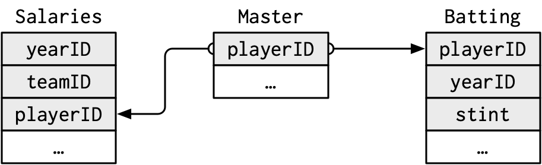

```{r setup, include=FALSE}
knitr::opts_chunk$set(cache=TRUE)
```

Sommersemester 2023 | Stand: `r Sys.Date()`

```{r packages}
# Verwendete Pakete
library(nycflights13)
library(tidyverse)
```


# Übung 1

## 1. Aufgabe

1. Finde in einer einzelnen Pipeline alle Flüge, die jede der folgenden Bedingungen erfüllen:

    -   Hatten eine Ankunftsverspätung von zwei oder mehr Stunden
    - Fliegen nach Houston (IAH oder HOU)
    - Wurden von United, American oder Delta durchgeführt
    - Sind im Sommer abgeflogen (Juli, August und September)
    - Sind mehr als zwei Stunden zu spät angekommen, sind aber nicht zu spät abgeflogen
    - Waren um mindestens eine Stunde verspätet, haben aber während des Fluges mehr als 30 Minuten aufgeholt

```{r}
flights %>%
  filter(arr_delay >= 120)
```
```{r}
flights %>%
  filter(dest %in% c("IAH", "HOU"))
```

```{r}
flights %>%
  filter(carrier %in% c("UA", "AA", "DL"))
```

```{r}
flights %>%
  filter(month %in% c(7, 8, 9))
```

```{r}
flights %>%
  filter(arr_delay > dep_delay & dep_delay <= 0)
```

```{r}
flights %>%
  filter(dep_delay >= 60 & (dep_delay - arr_delay) > 30)
```

## 2. Aufgabe
Sortiere die Flüge, um die Flüge mit den längsten Abflugverspätungen zu finden. Finde die Flüge, die am frühesten am Morgen abgeflogen sind.
```{r}
flights %>%
  arrange(desc(dep_delay))
```

```{r}
flights %>%
  arrange(dep_time)
```

## 3. Aufgabe
Sortiere die Flüge, um die schnellsten Flüge zu finden. (Tipp: Versuche eine mathematische Berechnung in deiner Funktion zu verwenden.)
```{r}
flights %>%
  arrange(desc(distance / air_time * 60))
```

## 4. Aufgabe:
Welche Flüge sind die weiteste Strecke geflogen? Welche haben die kürzeste Strecke zurückgelegt?
```{r}
flights %>% 
  arrange(desc(distance))
```

```{r}
flights %>% 
  arrange(distance)
```

## 5. Aufgabe
Spielt es eine Rolle, in welcher Reihenfolge du filter() und arrange() verwendest, wenn du beide verwendest? Warum / warum nicht? Denke über die Ergebnisse und die Arbeit nach, die die Funktionen leisten müssten.

**Lösung**
Ja, die Reihenfolge der Verwendung von filter() und arrange() in R spielt eine Rolle und kann zu unterschiedlichen Ergebnissen führen.

Wenn Sie filter() vor arrange() verwenden, wird die Datensatz zuerst nach den Filterbedingungen reduziert und dann werden die übrig gebliebenen Zeilen sortiert. Dies bedeutet, dass alle Filterbedingungen in den sortierten Zeilen beibehalten werden.

Wenn Sie jedoch arrange() vor filter() verwenden, werden zuerst die Zeilen sortiert und dann die Filterbedingungen angewendet. In diesem Fall werden die Filterbedingungen nur auf den sortierten Zeilen angewendet. Dies kann dazu führen, dass einige der ursprünglichen Filterbedingungen verletzt werden und nicht mehr erfüllt werden.

Zum Beispiel, wenn Sie einen Datensatz mit Personen haben und filtern wollen, um nur die Personen zu behalten, die in einem bestimmten Alter sind, und dann nach dem Namen sortieren möchten, wäre die korrekte Reihenfolge filter() und dann arrange(). Wenn Sie jedoch zuerst nach Namen sortieren und dann nach Alter filtern, können Personen in der resultierenden Datensatz enthalten sein, die nicht dem ursprünglichen Filterkriterium entsprechen.

Insgesamt hängt die richtige Reihenfolge von der Analyse ab, die Sie durchführen möchten, und von den Anforderungen Ihrer Daten. Wenn Sie unsicher sind, welche Reihenfolge für Ihre spezifische Analyse am besten geeignet ist, können Sie beide Methoden ausprobieren und die Ergebnisse vergleichen, um die beste Option für Ihre Bedürfnisse auszuwählen.

# Übung 2
## 1. Aufgabe
Vergleiche dep_time, sched_dep_time, und dep_delay. Welchen Zusammenhang erwartest du zwischen diesen drei Zahlen?
```{r}
flights %>% 
  select(dep_time, sched_dep_time, dep_delay)
```

dep_time bezieht sich auf die tatsächliche Abflugzeit eines Fluges, während sched_dep_time die geplante Abflugzeit angibt. Der dep_delay gibt die Verspätung bei der Abflugzeit an, die als Differenz zwischen dep_time und sched_dep_time berechnet wird.

In Bezug auf den Zusammenhang zwischen diesen drei Variablen können wir erwarten, dass, wenn ein Flugzeug gemäß dem geplanten Zeitplan abfliegt, dep_delay gleich Null sein wird, da die Differenz zwischen dep_time und sched_dep_time Null sein wird. Wenn jedoch ein Flugzeug später als geplant abfliegt, wird dep_delay positiv sein, was bedeutet, dass der Abflug verzögert war.

Insgesamt können wir also sagen, dass dep_time und sched_dep_time direkt mit dep_delay verbunden sind. Wenn ein Flug später als geplant abfliegt, wird die Abflugzeit (dep_time) später als die geplante Abflugzeit (sched_dep_time) sein, was zu einer positiven dep_delay führt.

## 2. Aufgabe
Überlege dir so viele Möglichkeiten wie möglich, um dep_time, dep_delay, arr_time und arr_delay aus flights auszuwählen.

```{r}
select(flights, dep_time, dep_delay, arr_time, arr_delay)
```

```{r}
select(flights, "dep_time", "dep_delay", "arr_time", "arr_delay")
```

```{r}
select(flights, 4, 6, 7, 9)
```

```{r}
select(flights, all_of(c("dep_time", "dep_delay", "arr_time", "arr_delay")))
```

```{r}
select(flights, any_of(c("dep_time", "dep_delay", "arr_time", "arr_delay")))
```

```{r}
variables <- c("dep_time", "dep_delay", "arr_time", "arr_delay")
select(flights, all_of(variables))
```

## 3. Aufgabe
Was passiert, wenn man den Namen der gleichen Variable mehrmals in einem select()-Aufruf angibt?
nichts
```{r}
flights %>% 
  select(-c(year, year))
```

## 4. Aufgabe
Was macht die Funktion any_of()?Warum könnte sie in Verbindung mit diesem Vektor hilfreich sein?

**Lösung** 
Die Funktion any_of() ist eine Funktion aus dem Paket dplyr, die verwendet wird, um eine Zeichenfolge (z. B. den Namen einer Variablen) mit einem Vektor von Spaltennamen zu vergleichen. Die Funktion gibt TRUE zurück, wenn die Zeichenfolge mit mindestens einem der Elemente des Vektors übereinstimmt, andernfalls gibt sie FALSE zurück.

In Verbindung mit dem gegebenen Vektor variables <- c("year", "month", "day", "dep_delay", "arr_delay") kann die Funktion any_of() verwendet werden, um zu überprüfen, ob eine bestimmte Spalte in einem Datensatz enthalten ist. Zum Beispiel, wenn wir einen Datensatz haben, der diese Spalten enthält, können wir mit der any_of()-Funktion überprüfen, ob eine bestimmte Spalte enthalten ist, ohne jeden Spaltennamen einzeln zu überprüfen.

Hier ist ein Beispiel, wie man die any_of()-Funktion verwenden könnte, um zu überprüfen, ob ein Datensatz Spalten mit den Namen aus dem Vektor variables enthält:

```{r}
# Vektor von Spaltennamen
variables <- c("year", "month", "day", "dep_delay", "arr_delay")

# Auswählen der Spalten aus dem Datensatz, die in dem Vektor von Spaltennamen enthalten sind
selected_columns <- flights %>% 
  select(any_of(variables))

# Ergebnis
selected_columns
```

## 5. Aufgabe
Überrascht dich das Ergebnis des folgenden Codes? Wie gehen die Select-Helfer standardmäßig mit der Groß- und Kleinschreibung um? Wie kannst du diese Voreinstellung ändern?
```{r}
flights %>% select(contains("TIME"))
```
Die contains()-Funktion wählt alle Spalten aus, die einen bestimmten String in ihrem Namen enthalten. Die contains()-Funktion ist standardmäßig nicht casesensitive, d.h. sie unterscheidet nicht zwischen Groß- und Kleinschreibung. Das bedeutet, dass alle Spalten ausgewählt werden, die den String "TIME", "time" oder "Time" im Namen enthalten.

Wenn Sie jedoch eine Funktion verwenden möchten, die casesensitive ist, können Sie die matches()-Funktion anstelle von contains() verwenden und einen regulären Ausdruck (Regex) als Argument übergeben, um die Groß- und Kleinschreibung zu steuern.

## 6. Aufgabe
Benenne air_time in air_time_min um, um die Maßeinheiten anzugeben und verschiebe es an den Anfang des Datensatzes.
```{r}
# air_time in air_time_min umbenennen und an den Anfang des Datensatzes verschieben
flights %>% 
  rename(air_time_min = air_time) %>% 
  relocate(air_time_min)
```

## 7. Aufgabe
Warum funktioniert das Folgende nicht, und was bedeutet der Fehler?

**Lösung**
Der Code führt zu einem Fehler, weil Sie arrange() auf eine Spalte anwenden, die in der aktuellen Pipeline nicht vorhanden ist.

In Ihrer Pipeline haben Sie nur die Spalte tailnum ausgewählt und arrange() wurde auf dieser reduzierten Datenmenge angewendet. Da arr_delay nicht in den ausgewählten Spalten enthalten ist, gibt es eine Fehlermeldung, wenn arrange() versucht, den Datensatz basierend auf dieser Spalte zu ordnen.

Um den Fehler zu beheben, müssen Sie sicherstellen, dass arr_delay in der aktuellen Pipeline verfügbar ist. Sie können beispielsweise die Spalte arr_delay mit select() auswählen, bevor Sie arrange() anwenden:

```{r}
flights %>%
  select(tailnum, arr_delay) %>%  # arr_delay auswählen
  arrange(arr_delay)
```

# Übung 3

## 1.Aufgabe
Welcher Anbieter hat die schlechtesten durchschnittlichen Verspätungen? Herausforderung: Kannst du die Auswirkungen von schlechten Flughäfen und schlechten Anbietern auseinanderhalten? Warum / warum nicht? (Tipp: denke darüber nach: `flights %>% group_by(carrier, dest) %>% summarize(n())`).

Um den Anbieter mit den schlechtesten durchschnittlichen Verspätungen zu finden, können wir den flights-Datensatz gruppieren und die durchschnittlichen Verspätungen für jeden Anbieter berechnen. Hier ist ein Beispielcode, der dies tut:

```{r}
flights %>%
  group_by(carrier) %>%
  summarize(avg_delay = mean(arr_delay, na.rm = TRUE)) %>%
  arrange(desc(avg_delay))

```

```{r}
filter(airlines, carrier == "F9")
```


Dieser Code gruppiert den flights-Datensatz nach dem Anbieter und berechnet den durchschnittlichen Verspätungswert für jeden Anbieter. Das na.rm = TRUE -Argument sorgt dafür, dass alle fehlenden Werte in der arr_delay Spalte ignoriert werden. Wir ordnen die Ergebnisse dann nach dem avg_delay Wert, um den Anbieter mit den schlechtesten durchschnittlichen Verspätungen zu finden.

Um die Auswirkungen von schlechten Flughäfen und schlechten Anbietern auseinanderzuhalten, müssen wir Airline, Abflugort und Ankunftsort berücksichtigen.

```{r}
flights %>%
  summarise(carrier_n = n_distinct(carrier),
            origin_n = n_distinct(origin),
            dest_n = n_distinct(dest))
```

```{r}
flights %>%
  filter(!is.na(arr_delay)) %>%
  # Total delay by carrier within each origin, dest
  group_by(origin, dest, carrier) %>%
  summarise(
    arr_delay_odc_sum = sum(arr_delay),
    flights_odc = n()) %>%
  # Total delay within each origin dest
  mutate(
    arr_delay_od_sum = sum(arr_delay_odc_sum),
    flights_od = sum(flights_odc)) %>%
  # average delay of each carrier - average delay of other carriers
  ungroup() %>%
  mutate(
    arr_delay_others = (arr_delay_od_sum - arr_delay_odc_sum) / (flights_od - flights_odc),
    arr_delay_mean = arr_delay_odc_sum / flights_odc,
    arr_delay_diff = arr_delay_mean - arr_delay_others) %>%
  # remove NaN values (when there is only one carrier)
  filter(is.finite(arr_delay_diff)) %>%
  # average over all airports it flies to
  group_by(carrier) %>%
  summarise(arr_delay_diff = mean(arr_delay_diff)) %>%
  ggplot(aes(x=carrier, y=arr_delay_diff)) + 
    geom_bar(stat = "identity")
```

## 2.Aufgabe
Finde die Flüge, die bei der Abreise von jedem Zielort am meisten verspätet sind.
```{r}
flights %>% 
  group_by(dest) %>% 
  slice_max(dep_delay, n = 1) %>% 
  relocate(dest)
```

## 3.Aufgabe
Wie variieren Verspätungen im Laufe des Tages? Veranschauliche deine Antwort mit einem Diagramm.
```{r}
flights %>%
  filter(!is.na(arr_delay)) %>%
  group_by(hour) %>%
  summarise(avg_arr_delay = mean(arr_delay)) %>%
  ggplot(aes(x = hour, y = avg_arr_delay)) +
  geom_line() +
  labs(x = "Stunde des Tages", y = "Durchschnittliche Ankunftsverspätung (Minuten)")
```

## 4.Aufgabe
Was passiert, wenn du slice_min() und verwandten Funktionen eine negative `n` lieferst?
```{r}
flights %>% 
  slice_min(dep_delay, n = -1, with_ties = F)
```
Es werden `n` Zeilen entfernt. 


## 5.Aufgabe
Erkläre, was count() im Hinblick auf die dplyr-Verben tut, die du gerade gelernt hast. Was macht das sort-Argument von count()?

count() ist ein dplyr-Verb, das verwendet wird, um die Anzahl der Vorkommen von eindeutigen Werten in einer oder mehreren Spalten zu zählen und eine Zusammenfassung des Ergebnisses zurückzugeben. count() kann auch in Verbindung mit anderen dplyr-Verben wie group_by(), summarize() und slice() verwendet werden, um die Ergebnisse weiter zu manipulieren.


## 6.Aufgabe
Angenommen, wir haben den folgenden winzigen Datensatz:
    ```{r}
    df <- tibble(
      x = 1:5,
      y = c("a", "b", "a", "a", "b"),
      z = c("K", "K", "L", "L", "K")
    )
    ```

a.  Wie wird die Ausgabe aussehen? Hattest du Recht? Beschreibe zuletzt mit eigenen Worten, was `group_by()` tut.

    Die Ausgabe wird die gruppierten Daten nach der Spalte "y" zeigen. Die `group_by()`-Funktion teilt den Datensatz in separate Gruppen basierend auf den eindeutigen Werten in der angegebenen Spalte.

    ```{r}
    df %>%
      group_by(y)
    ```

b.  Wie wird die Ausgabe aussehen? Hattest du Recht? Beschreibe mit eigenen Worten, was `arrange()` tut. Kommentiere auch, inwiefern sich diese Funktion von group_by() in Aufgabe 6a (a) unterscheidet.

    Die Ausgabe wird den Datensatz nach der Spalte "y" sortiert zeigen. Die `arrange()`-Funktion sortiert den Datensatz nach den angegebenen Spalten in aufsteigender Reihenfolge. Im Vergleich zu `group_by()` werden die Daten nicht gruppiert, sondern nur sortiert.

    ```{r}
    df %>%
      arrange(y)
    ```

c.  Wie wird die Ausgabe aussehen? Hattest du Recht? Beschreibe mit eigenen Worten, was die pipeline tut.

    Die Ausgabe wird die aggregierten Daten nach der Spalte "y" mit der durchschnittlichen "x"-Wert für jede Gruppe zeigen. Die Pipeline führt eine Gruppierung nach "y" durch und berechnet dann den Durchschnitt von "x" für jede Gruppe mit der `summarize()`-Funktion.

    ```{r}
    df %>%
      group_by(y) %>%
      summarize(mean_x = mean(x))
    ```

d.  Wie wird die Ausgabe aussehen? Hattest du Recht? Beschreibe mit eigenen Worten, was die pipeline tut. Was steht in der Nachricht in der Konsole?

    Die Ausgabe wird die aggregierten Daten nach den Spalten "y" und "z" zeigen, wobei der Durchschnitt von "x" für jede Kombination der beiden Gruppen berechnet wird. Die Nachricht in der Konsole lautet "Adding missing grouping variables: `z`". Dies bedeutet, dass die Spalte "z" zur Gruppierung hinzugefügt wurde, da sie in der `summarize()`-Funktion verwendet wurde, aber nicht in der `group_by()`-Funktion angegeben war.

    ```{r}
    df %>%
      group_by(y, z) %>%
      summarize(mean_x = mean(x))
    ```

e.  Wie wird die Ausgabe aussehen? Hattest du Recht? Beschreibe mit eigenen Worten, was die pipeline tut. Wie unterscheidet sich der Output von Frage 6d.

    Die Ausgabe wird die aggregierten Daten nach den Spalten "y" und "z" zeigen, wobei der Durchschnitt von "x" für jede Kombination der beiden Gruppen berechnet wird. Der Unterschied zu Frage 6d besteht darin, dass der Parameter `.groups = "drop"` hinzugefügt wurde, um die Gruppierungsattribute aus der Ausgabe zu entfernen.

    ```{r}
    df %>%
      group_by(y, z) %>%
      summarize(mean_x = mean(x), .groups = "drop")
    ```

f.  Wie wird die Ausgabe aussehen? Hattest du Recht? Beschreibe mit eigenen Worten, was die pipeline tut. Wie unterscheiden sich die beiden pipelines?

    Die erste Pipeline wird die aggregierten Daten nach den Spalten "y" und "z" zeigen, wobei der Durchschnitt von "x" für jede Kombination der beiden Gruppen berechnet wird. Die zweite Pipeline wird eine neue Spalte "mean_x" hinzufügen, die den Durchschnitt von "x" für jede Zeile in der jeweiligen Gruppe enthält. Der Unterschied besteht darin, dass `summarize()` die Datensatzgröße reduziert und eine Zeile pro Gruppe zurückgibt, während `mutate()` die gleiche Anzahl von Zeilen beib ehält und eine neue Spalte für jede Zeile im Datensatz hinzufügt.

    ```{r}
    df %>%
    group_by(y, z) %>%
    summarize(mean_x = mean(x))
                
    df %>%
    group_by(y, z) %>%
    mutate(mean_x = mean(x))
    ```

# Übung 4

Lösungen für `pivot_longer()`:

## Aufgabe 1
Verwandle breite Daten in lange Daten:
```{r}
# Beispiel-Datensatz
daten <- tribble(
  ~Land, ~Januar, ~Februar, ~März,
  "Deutschland", 100, 120, 90,
  "USA", 150, 180, 200
)

# Pivotieren der Daten
daten %>%
  pivot_longer(cols = Januar:März, names_to = "Monat", values_to = "Besucher")
```

## Aufgabe 2
Aggregiere mehrere Spalten zu einer einzigen Spalte:
```{r}
# Beispiel-Datensatz
daten <- tribble(
  ~ID, ~Kategorie_A, ~Kategorie_B, ~Kategorie_C,
  1, "A1", "B1", "C1",
  2, "A2", "B2", "C2",
  3, "A3", "B3", "C3"
)

# Pivotieren der Daten
daten %>%
  pivot_longer(cols = Kategorie_A:Kategorie_C, names_to = "Kategorie", values_to = "Wert")
```

## Aufgabe 3
Arbeite mit Spaltennamen als Werten:
```{r}
# Beispiel-Datensatz
daten <- tribble(
  ~Produkt_A, ~Produkt_B, ~Produkt_C,
  10, 8, 5,
  15, 12, 10,
  20, 18, 15
)

# Pivotieren der Daten
daten %>%
  pivot_longer(cols = Produkt_A:Produkt_C, names_to = "Produkt", values_to = "Verkaufspreis")
```

Lösungen für `pivot_wider()`:

## Aufgabe 4
Transformiere lange Daten in breite Daten:
```{r}
# Beispiel-Datensatz
daten <- tribble(
  ~Land, ~Monat, ~Besucher,
  "Deutschland", "Januar", 100,
  "Deutschland", "Februar", 120,
  "USA", "Januar", 150,
  "USA", "Februar", 180
)

# Pivotieren der Daten
daten %>%
  pivot_wider(names_from = Monat, values_from = Besucher)
```

## Aufgabe 5
Erstelle neue Spalten aus einer einzelnen Spalte:
```{r}
# Beispiel-Datensatz
daten <- tribble(
  ~ID, ~Kategorie, ~Wert,
  1, "A", 10,
  1, "B", 20,
  2, "A", 15,
  2, "B", 25
)

# Pivotieren der Daten
daten %>%
  pivot_wider(names_from = Kategorie, values_from = Wert)
```

## Aufgabe 6
Summiere Werte aus mehreren Zeilen:
```{r}
# Beispiel-Datensatz
daten <- tribble(
  ~Kategorie, ~Monat, ~Wert,
  "A", "Januar

", 100,
  "A", "Februar", 120,
  "B", "Januar", 150,
  "B", "Februar", 180
)

# Pivotieren der Daten
daten %>%
  pivot_wider(names_from = Kategorie, values_from = Wert)
```

# Übung 5
## Aufgabe 1
Die Beziehung zwischen `weather` und `airports` ist in der Visulaiserung der Relationen nicht dargestellt. Was ist die Beziehung und wie sollte sie im Diagramm dargestellt werden?
   
Die beiden Tabellen können mit den Variablen `origin` in Wetter und `faa` in Flughäfen abgeglichen werden.
```{r}
colnames(weather)
```
```{r}
colnames(airports)
```

```{r}
weather %>% 
  select(origin) %>% 
  table()
```
```{r}
airports %>% 
  filter(faa %in% c("EWR", "JFK", "LGA"))
```

## Aufgabe 2
`weather` enthält nur Informationen für die drei Ursprungsflughäfen in New York City. Wenn es Wetteraufzeichnungen für alle Flughäfen in den USA enthalten würde, welche zusätzliche Verbindung würde es zu `flights` herstellen?

Wenn das Wetter für alle Flughäfen in den USA enthalten wäre, würde es das Wetter für den Zielort jedes Fluges liefern. Die Spalten des Wetterdatensatzes (Jahr, Monat, Tag, Stunde, Herkunft) sind ein Fremdschlüssel für die Spalten des Flugdatensatzes (Jahr, Monat, Tag, Stunde, Ziel). Dies würde Informationen über das Wetter am Zielflughafen zum Zeitpunkt des Abflugs liefern, es sei denn, die Ankunftszeit wurde berechnet.

## Aufgabe 3
Wir wissen, dass einige Tage im Jahr besonders sind und weniger Menschen als üblich fliegen (z.B. Heiligabend und Weihnachtstag). 
   Wie könntest du diese Daten als Datensatz darstellen? 
   Was wäre der Primärschlüssel? 
   Wie würde er sich mit den vorhandenen Datensätzen verbinden?
   
Man könnte einen separaten Datensatz mit den Feiertagen in den USA nach Tag und Monat erstellen. Mit diesen Informationen lassen sich die einzelnen Flüge im Datensatz "flights" abgleichen.

## Aufgabe 4
Zeichne ein Diagramm, das die Verbindungen zwischen den Datensätzen `Batting`, `People` und `Salaries` im Lahman-Paket veranschaulicht. 

```{r}
require(Lahman)
glimpse(Batting)
glimpse(People)
glimpse(Salaries)
```

Für die Tabellen `Batting`, `People` und `Salaries` gelten folgende Informationen:

-   `People`
    -   Primärschlüssel: `playerID`

-   `Batting`
    -   Primärschlüssel: `playerID`, `yearID`, `stint`
    -   Fremdschlüssel: `playerID` = `Master$playerID` (mehrere zu eins)

-   `Salaries`
    -   Primärschlüssel: `yearID`, `teamID`, `playerID`
    -   Fremdschlüssel: `playerID` = `Master$playerID` (mehrere zu eins)

Die Spalten `teamID` und `lgID` sind keine Fremdschlüssel, obwohl sie in mehreren Tabellen vorkommen (mit derselben Bedeutung), da sie keine Primärschlüssel für eine der betrachteten Tabellen in dieser Übung sind.
Die Variable `teamID` verweist auf `Teams$teamID`, und `lgID` hat keine eigene Tabelle.

*R for Data Science* verwendet Datenbankschemadiagramme, um die Beziehungen zwischen den Tabellen zu veranschaulichen.
Die meisten Flussdiagramm- oder Diagrammsoftware können verwendet werden, um Datenbankschemadiagramme zu erstellen, ebenso wie einige spezialisierte Datenbanksoftware.
Die Diagramme in *R for Data Science* wurden mit [OmniGraffle](https://www.gliffy.com/) erstellt, und ihre Quellen befinden sich im [GitHub-Repository](https://github.com/hadley/r4ds/tree/master/diagrams).

Das folgende Diagramm wurde mit OmniGraffle im gleichen Stil wie die Diagramme in *R for Data Science* erstellt.
Es zeigt die Beziehungen zwischen den Tabellen `Master` (entspricht `People`), `Batting` und `Salaries`.

```{r, echo = FALSE, out.width = NULL, purl = FALSE}

```

# Übung 6
## Aufgabe 1
1a. Angenommen, du hast zwei Datensätze `df1` und `df2` mit einer gemeinsamen Spalte "ID". Führe einen `left_join()` durch und speichere das Ergebnis im Datensatz `merged_df`. Gib anschließend den resultierenden Datensatz aus.

```{r}
library(dplyr)

# Erzeuge Beispieldaten
df1 <- data.frame(ID = c(1, 2, 3, 4),
                  Name = c("Alice", "Bob", "Charlie", "David"))

df2 <- data.frame(ID = c(2, 3, 5),
                  Age = c(25, 30, 35))

# Führe left_join() durch
merged_df <- left_join(df1, df2, by = "ID")

# Gib das Ergebnis aus
merged_df
```

1b. Gegeben sind zwei Datensätze `df3` und `df4` mit einer gemeinsamen Spalte "ID". Führe einen `inner_join()` durch und speichere das Ergebnis im Datensatz `merged_inner`. Gib anschließend den resultierenden Datensatz aus.

```{r}
# Erzeuge Beispieldaten
df3 <- data.frame(ID = c(1, 2, 3, 4),
                  Name = c("Alice", "Bob", "Charlie", "David"))

df4 <- data.frame(ID = c(2, 3, 5),
                  Age = c(25, 30, 35))

# Führe inner_join() durch
merged_inner <- inner_join(df3, df4, by = "ID")

# Gib das Ergebnis aus
merged_inner
```

1c. Angenommen, du hast zwei Datensätze `df5` und `df6` mit einer gemeinsamen Spalte "ID". Führe einen `right_join()` durch und speichere das Ergebnis im Datensazt `merged_right`. Gib anschließend den resultierenden Datensatz aus.

```{r}
# Erzeuge Beispieldaten
df5 <- data.frame(ID = c(1, 2, 3, 4),
                  Name = c("Alice", "Bob", "Charlie", "David"))

df6 <- data.frame(ID = c(2, 3, 5),
                  Age = c(25, 30, 35))

# Führe right_join() durch
merged_right <- right_join(df5, df6, by = "ID")

# Gib das Ergebnis aus
merged_right
```

1d. Gegeben sind zwei Datensätze `df7` und `df8` mit einer gemeinsamen Spalte "ID". Führe einen `full_join()` durch und speichere das Ergebnis im Datensatz `merged_full`. Gib anschließend den resultierenden Datensatz aus.

```{r}
# Erzeuge Beispieldaten
df7 <- data.frame(ID = c(1, 2, 3, 4),
                  Name = c("Alice", "Bob", "Charlie", "David"))

df8 <- data.frame(ID = c(2, 3, 5),
                  Age = c(25, 30, 35))

# Führe full_join() durch
merged_full <- full_join(df7, df8, by = "ID")

# Gib das Ergebnis aus
merged_full
```

1e. Angenommen, du hast zwei Datensätze `df9` und `df10` mit einer gemeinsamen Spalte "ID". Führe einen `semi_join()` durch und speichere das Ergebnis im Datensatz `merged_semi`. Gib anschließend den resultierenden Datensatz aus.

```{r}
# Erzeuge Beispieldaten
df9 <- data.frame(ID = c(1, 2, 3, 4),
                  Name = c("Alice", "Bob", "Charlie", "David"))

df10 <- data.frame(ID = c(2, 3, 5),
                   Age = c(25, 30, 35))

# Führe semi_join() durch
merged_semi <- semi_join(df9, df10, by = "ID")

# Gib das Ergebnis aus
merged_semi
```

1f. Gegeben sind zwei Datensätze `df11` und `df12` mit einer gemeinsamen Spalte "ID". Führe einen `anti_join()` durch und speichere das Ergebnis im Datensatz `merged_anti`. Gib anschließend den resultierenden Datensatz aus.

```{r}
# Erzeuge Beispieldaten
df11 <- data.frame(ID = c(1, 2, 3, 4),
                   Name = c("Alice", "Bob", "Charlie", "David"))

df12 <- data.frame(ID = c(2, 3, 5),
                   Age = c(25, 30, 35))

# Führe anti_join() durch
merged_anti <- anti_join(df11, df12, by = "ID")

# Gib das Ergebnis aus
merged_anti
```


