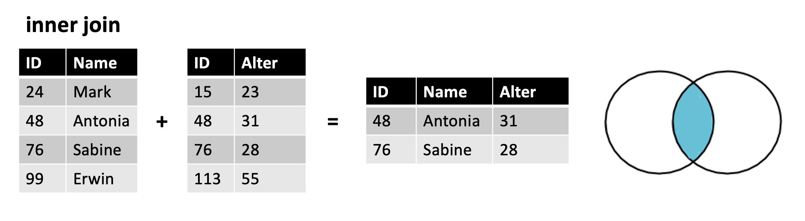
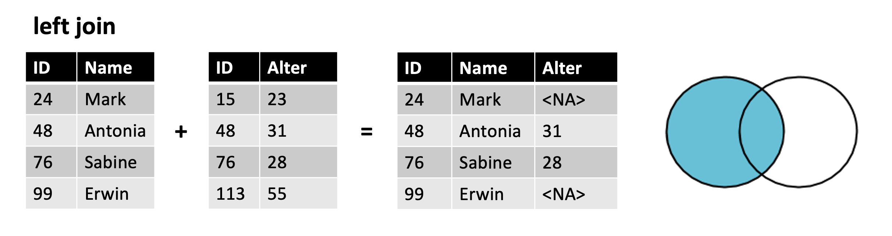
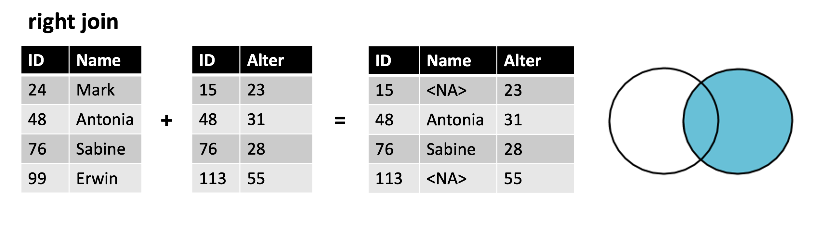
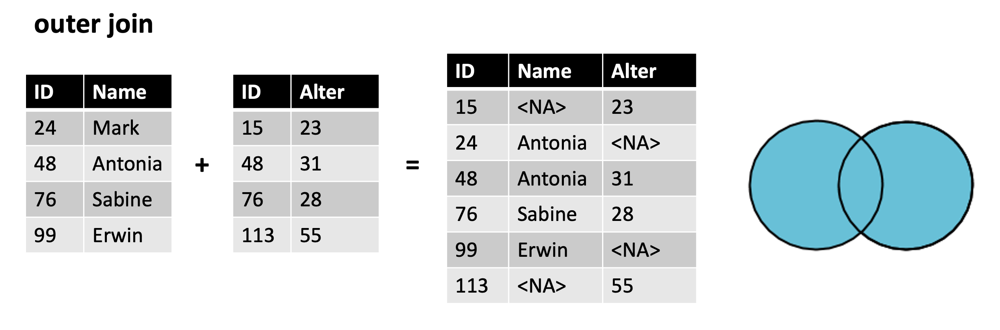

```{r setup, include=FALSE}
knitr::opts_chunk$set(cache=TRUE)
```

Sommersemester 2023 | Stand: `r Sys.Date()`

Hinweis: Zum jetzigen Zeitpunkt dieses Skipt in weiten Teilen eine Übersetzung des großartigen Buches [R for Data Science](https://r4ds.hadley.nz). 

Dieses Werk ist lizenziert unter einer [Creative Commons Namensnennung-Nicht kommerziell 4.0 International Lizenz](http://creativecommons.org/licenses/by-nc/4.0/). 
{width="10%"}

{width="45%"}
{width="45%"}


# Einführung
In diesem Kurs geht es um die Programmiersprache R. Doch was ist das eigentlich?

## Was ist R
R ist eine Programmiersprache und eine Umgebung für statistische Berechnungen und Grafiken. Es wurde von Statistik-begeisterten Menschen entwickelt und ist heute eine der am häufigsten verwendeten Sprachen in der Datenanalyse und im Machine Learning. R bietet eine Vielzahl von Paketen und Bibliotheken, die es Benutzern ermöglichen, verschiedene statistische Analysen durchzuführen, Daten zu visualisieren und Modelle zu entwickeln. Die Syntax von R ähnelt der von MATLAB und Python, aber R wurde speziell für die statistische Analyse entwickelt.

## Was ist RStudio
RStudio ist eine integrierte Entwicklungsumgebung (IDE) für R. Es ist eine kostenlose und quelloffene Software, die von Posit entwickelt wird und die es Benutzern erleichtert, R-Code zu schreiben und auszuführen. RStudio bietet eine Reihe von Funktionen, die den Workflow erleichtern, einschließlich der Möglichkeit, R-Skripte zu erstellen, Daten und Grafiken zu visualisieren, R-Pakete zu verwalten und RMarkdown-Dokumente zu erstellen, die Text und Code kombinieren. RStudio ist eine der beliebtesten IDEs für R und wird von vielen Benutzern aufgrund seiner Benutzerfreundlichkeit, Funktionalität und Erweiterbarkeit bevorzugt.

## Das Tidyverse
Tidyverse ist eine Sammlung von R-Paketen, die von Posit entwickelt wurde, um die Arbeit mit Daten in R zu erleichtern. Tidyverse stellt eine alternative Arbeitsweise zur Datenmanipulation und Visualisierung im Vergleich zur traditionellen Basis-R-Syntax bereit.

Tidyverse bietet eine Vielzahl von Paketen, die speziell für die Datenanalyse konzipiert sind. Diese Pakete sind so konzipiert, dass sie nahtlos miteinander arbeiten und es dem Benutzer ermöglichen, Daten schnell und effektiv zu manipulieren, zu bereinigen, zu transformieren und zu visualisieren. Einige der wichtigsten Pakete in Tidyverse sind:

- ggplot2: Ein Paket für die Erstellung ansprechender und professioneller Grafiken.
- dplyr: Ein Paket für die Datenmanipulation und -filterung.
- tidyr: Ein Paket für die Bereinigung und Umstrukturierung von Daten.
- readr: Ein Paket für den Import von Daten aus verschiedenen Dateiformaten.

Tidyverse hat einige Vorteile gegenüber traditionellen Basis-R-Syntax, insbesondere bei der Datenmanipulation. Der Einsatz des Pipe-Operators (%>%) ermöglicht es Benutzern, eine Folge von Operationen in einer einzigen Zeile zu schreiben, was die Lesbarkeit und den Workflow verbessert. Tidyverse ist auch so konzipiert, dass es gut mit dem Konzept der "tidy data" (saubere Daten) arbeitet, das besagt, dass Daten in einer strukturierten, les- und bearbeitbaren Art und Weise organisiert sein sollten.

Insgesamt ist Tidyverse eine leistungsstarke und intuitive Alternative zur traditionellen Basis-R-Syntax, die es Benutzern ermöglicht, Daten effektiver und schneller zu manipulieren und zu visualisieren. Es hat sich als eine der wichtigsten R-Bibliotheken für die Datenanalyse und -visualisierung etabliert und wird von vielen R-Entwicklern und Datenwissenschaftlern weltweit genutzt.

## Tidy Data
Unter diesem Begriff verbirgt sich die Idee, wie Daten aussehen sollen. ,Sie sind in einer spezifischen, standardisierten Form organisiert, um eine einfache Datenanalyse und -visualisierung zu ermöglichen. Die Tidy-Data-Prinzipien wurden von Hadley Wickham, dem Schöpfer von Tidyverse, definiert und beziehen sich auf eine bestimmte Strukturierung von Daten, die in der Regel aus drei Schlüsselelementen besteht:

1. Jede Variable hat eine Spalte: Jede Variable, die in den Daten erfasst wird, sollte in einer separaten Spalte aufgeführt werden. Zum Beispiel sollten Alter, Geschlecht und Einkommen jeweils ihre eigene Spalte in den Daten haben.
2. Jeder Beobachtung hat eine Zeile: Jede Beobachtung, die in den Daten erfasst wird, sollte in einer separaten Zeile aufgeführt werden. Zum Beispiel sollte jede Person oder jeder Kunde eine eigene Zeile in den Daten haben.
3. Jeder Wert hat eine Zelle: Jeder Wert in den Daten sollte in einer einzelnen Zelle aufgeführt werden. Es sollten keine Zellen geben, die mehrere Werte enthalten oder Zellen, die leer sind.

Die Strukturierung von Daten nach diesen Prinzipien erleichtert es den Benutzern, Daten effektiver zu manipulieren, zu transformieren, zu visualisieren und zu analysieren. Tidy data sind auch leichter zu verstehen und zu kommunizieren, da die Daten in einer klaren und standardisierten Form dargestellt werden. Die Verwendung von tidy data ist ein wichtiger Bestandteil von Tidyverse und wird von vielen Data-Science-Experten und -Praktikern empfohlen.

{width="80%"}

---

# Grundlagen: Datawrangling mit dplyr
In diesem Kapitel geht es um das Paket dplyr, was ein unerlässlicher Bestandteil vom tidyverse ist. Wir werden die wichtigsten Ideen anhand von Daten aus dem Paket nycflights13 veranschaulichen.

## Voraussetzungen
Somit müssen wir als erstes das tidyverse und den Datensatz laden.

```{r}
library(nycflights13)
library(tidyverse)
library(gcookbook)

# wird normalerweis automatisch ausgegeben
# tidyverse_conflicts()
```

Achtet hierbei auf die automatisch erscheinende Konfliktmeldung, wenn tidyverse geladen wird. Diese zeigt an, dass dplyr einige Funktionen von Base R überschreibt. Wenn du nach dem Laden von dplyr die Basisversion dieser Funktionen verwenden möchtest, musst du ihre vollständigen Namen angeben: `stats::filter()` und `stats::lag()`. Bis jetzt haben wir meistens nicht beachtet, aus welchem Paket eine Funktion stammt, da es in der Regel keine Rolle spielt. Wenn du jedoch genau wissen musst, aus welchem Paket eine Funktion stammt, verwendest du die gleiche Syntax wie in R: `Paketname::Funktionsname()`.

Um die grundlegenden dplyr-Verben zu erkunden, werden wir nycflights13::flights verwenden. Dieser Datensatz enthält alle 336.776 Flüge, die 2013 von New York City abgeflogen sind. Die Daten stammen vom US Bureau of Transportation Statistics und sind in `?flights` dokumentiert. Dieser Datensatz wir häufig für die Einführung in dplyr verwendet. Bei Problemen findet man somit fast immer eine Lösung.

```{r}
flights
```
Flights ist eine Tabelle, eine besondere Art von dataframe, die von Tidyverse verwendet wird, um einige häufige Probleme zu vermeiden. Der wichtigste Unterschied zwischen Tibbles und klassischen dataframes liegt darin, wie Tibbles ausgegeben werden. Sie sind für große Datensätze konzipiert, daher werden nur die ersten wenigen Zeilen und nur die Spalten angezeigt, die auf einem Bildschirm passen. Es gibt einige Optionen, um alles zu sehen. Wenn du RStudio verwendest, ist die bequemste wahrscheinlich `View(flights)`, die eine interaktive, scrollbare und filterbare Ansicht öffnet. Ansonsten kannst du `print(flights, width = Inf)` verwenden, um alle Spalten anzuzeigen, oder `glimpse()` verwenden:

```{r}
glimpse(flights)
```
In beiden Ansichten werden den Variablennamen Abkürzungen angehängt, die dir den Typ jeder Variablen mitteilen: <int> steht für Ganzzahl, <dbl> steht für Double (auch als reelle Zahlen bekannt). <int> ist eine Abkürzung für "integer" und bezeichnet ganze Zahlen ohne Nachkommastellen, wie zum Beispiel -1, 0 oder 42. <dbl> hingegen ist eine Abkürzung für "double" und bezeichnet Fließkommazahlen mit Nachkommastellen, wie zum Beispiel -1.23, 3.14159 oder 1000.0. Im Allgemeinen benötigen Berechnungen mit Fließkommazahlen (dbl) mehr Rechenleistung und Speicherplatz als Berechnungen mit ganzen Zahlen (int). Das <chr> steht für Zeichenfolge (auch als Strings bekannt) und <dttm> steht für Datum und Uhrzeit. Diese Informationen sind wichtig, da die Operationen, die du auf einer Spalte durchführen kannst, stark vom "Typ" abhängen.

## Basics
Du wirst gleich die wichtigsten dplyr Verben (Funktionen) lernen, mit denen du die meisten deiner Datenaufbereitungs-Herausforderungen bewältigen kannst. Bevor wir jedoch auf ihre individuellen Unterschiede eingehen, ist es wichtig zu erwähnen, was sie gemeinsam haben:

1. Das erste Argument ist immer ein dataframe
2. Die folgenden Argumente beschreiben in der Regel, auf welche Spalten die Operationen angewendet werden sollen, indem sie die Variablennamen (ohne Anführungszeichen) verwenden.
3. Das Ergebnis ist immer ein neuer dataframe

Da jedes Verb eine Sache gut macht, erfordert die Lösung komplexer Probleme normalerweise die Kombination mehrerer Verben, und wir werden dies mit dem Pipe-Operator %>% tun.
Kurz gesagt: der Pipe-Operator nimmt das, was links von ihm steht, und leitet es an die Funktion rechts davon weiter, so dass x %>% f(y) äquivalent zu f(x, y) ist und x %>% f(y) %>% g(z) äquivalent zu g(f(x, y), z) ist. Der einfachste Weg, den Pipe-Operator auszusprechen, ist "dann". Dadurch ist es möglich, eine Vorstellung von dem folgenden Code zu bekommen, auch wenn du die Details noch nicht kennst:

```{r, message=FALSE}
flights %>% 
  filter(dest == "IAH")  %>%  
  group_by(year, month, day) %>% 
  summarize(
    arr_delay = mean(arr_delay, na.rm = TRUE)
  )
```
Der Code filtert die Flüge, die nach "IAH" (Houston Intercontinental Airport) gehen, gruppiert **dann** die verbleibenden Flüge nach Jahr, Monat und Tag und berechnet **dann** den durchschnittlichen Ankunftsverspätung ("arr_delay") pro Gruppe. Daher gibt der Code eine Tabelle zurück, die die durchschnittlichen Ankunftsverspätungen für jeden Tag, Monat und Jahr enthält, an dem Flüge am Houston Intercontinental Airport (IAH) ankamen.

## Zeilen
Die wichtigsten Verben, die auf Zeilen eines Datensatzes wirken, sind `filter()`, das eine bestimmte Auswahl an Zeilen anzeigt, ohne ihre Reihenfolge zu ändern, und `arrange()`, das die Reihenfolge der Zeilen anzeigt, ohne die vorhandenen Zeilen zu ändern. Beide Funktionen wirken sich nur auf die Zeilen aus, während die Spalten unverändert bleiben. Wir werden auch `distinct()` besprechen, das Zeilen mit eindeutigen Werten findet, aber im Gegensatz zu `arrange()` und `filter()` kann es optional auch die Spalten ändern.


### `filter()`
`filter()` extrahiert nur die Zeilen aus einem Datensatz, die bestimmten Bedingungen entsprechen. Diese Bedingungen können logische Operationen oder Funktionen enthalten, die auf bestimmte Spalten angewendet werden. Es werden auch mehrere Bedingungen akzeptiert.

{width="80%"}

Das erste Argument ist wie immer der dataframe. Das zweite und die folgenden Argumente sind die Bedingungen, die erfüllt sein müssen. Zum Beispiel könnten wir alle Flüge finden, die mit mehr als 240 Minuten (vier Stunden) Verspätung abgeflogen sind:
```{r}
flights %>% 
  filter(dep_delay > 240)
```

Neben > (größer als) können Sie auch >= (größer als oder gleich), < (kleiner als), <= (kleiner als oder gleich), == (gleich) und != (nicht gleich) verwenden. Sie können Bedingungen auch mit & oder , kombinieren, um "und" (beide Bedingungen) oder mit | (eine der beiden Bedingungen) zu kennzeichnen. Allgemein kennt R verschiedene logische Operatoren, die in der Programmierung verwendet werden können, um Bedingungen zu verknüpfen Hier sind die wichtigsten logischen Operatoren in R:

- `!` (Negation): Dieser Operator wird verwendet, um den logischen Wert einer Aussage umzukehren. Zum Beispiel gibt !TRUE den Wert FALSE zurück und umgekehrt.
- `&` (UND): Dieser Operator gibt TRUE zurück, wenn beide Bedingungen, die links und rechts von ihm stehen, TRUE sind. Ansonsten gibt er FALSE zurück.
- `|` (ODER): Dieser Operator gibt TRUE zurück, wenn mindestens eine der beiden Bedingungen, die links und rechts von ihm stehen, TRUE ist. Ansonsten gibt er FALSE zurück.

Dann gibt es noch Kurzschluss-UND und -ODER. Diese funktionieren ähnlich wie UND und ODER, aber sie evaluieren Bedingungen auf eine etwas andere Art und Weise. Kurzschluss-UND und -ODER sind nützlich, wenn man Bedingungen hat, die zeitaufwendig sind, und man nicht beide Bedingungen auswerten muss, um die Entscheidung zu treffen.

- `&&` (Kurzschluss-UND): Dieser Operator evaluiert die linke Bedingung zuerst und nur wenn diese TRUE ist, wird die rechte Bedingung ausgewertet. Wenn die linke Bedingung FALSE ist, wird die rechte Bedingung nicht ausgewertet.
- `||` (Kurzschluss-ODER): Dieser Operator funktioniert analog und gibt nur dann TRUE zurück, wenn mindestens eine der beiden Bedingungen TRUE ist und die linke Bedingung nicht TRUE auswertet.

Aber zurück zu unserem Datensatz. Wenn nach Tag **und** Monat gefiltert werden soll, müssen nur die beiden Bedingungen mit einem `,` oder `&` verknüpft werden. Gleiches gilt für den ODER-Operator.
```{r}
# Flüge am 1. Januar
flights %>% 
  filter(month == 1 & day == 1)

# oder
# Flüge am 1. Januar
flights %>% 
  filter(month == 1, day == 1)
```

```{r}
# Flüge im Januar oder Febraur
flights %>% 
  filter(month == 1 | month == 2)
```

Es gibt eine nützliche Abkürzung, wenn du `|` und` ==` kombinieren willst: `%in%`. Damit bleiben Zeilen erhalten, in denen die Variable einem der Werte auf der rechten Seite entspricht:
```{r}
# Ein kürzerer Weg zur Auswahl von Flügen, die im Januar oder Februar abfliegen
flights %>% 
  filter(month %in% c(1, 2))
```

Durch `filter()` wird der dataframe nicht überschrieben, sondern nur die Auswahl in der Konsole ausgegeben. Um das Ergebnis zu speichern, musst den Zuweisungsoperator `<-` verwenden. Das geht am Anfang oder am Ende, dann aber ander herum:
```{r}
jan1 <- flights %>% 
  filter(month == 1 & day == 1)

flights %>% 
  filter(month == 1 & day == 1) -> jan1
```

### `arrange()`
Mit `arrange()` können diue Daten in einem dataframe nach einer oder mehreren Spalten sortiert werden. Es benötigt einen dataframe und eine Reihe von Spaltennamen (oder kompliziertere Ausdrücke), nach denen geordnet werden soll. Wenn Sie mehr als einen Spaltennamen angeben, wird jede zusätzliche Spalte verwendet, um Übereinstimmungen in den Werten der vorangegangenen Spalten aufzudröseln. Der folgende Code sortiert zum Beispiel nach der Abflugzeit, die auf vier Spalten verteilt ist. Wir erhalten zuerst die frühesten Jahre, dann innerhalb eines Jahres die frühesten Monate, usw.
```{r}
flights %>% 
  arrange(year, month, day, dep_time)
```

Du kannsz `desc()` für eine Spalte innerhalb von `arrange()` verwenden, um den dataframe auf der Grundlage dieser Spalte in absteigender Reihenfolge (von groß nach klein) neu zu ordnen. Zum Beispiel ordnet dieser Code die Flüge von der größten bis zur geringsten Verspätung:
```{r}
flights %>% 
   arrange(desc(dep_delay))
```

Die Anzahl der Zeilen ändert sich dabei nicht, da nicht gefiltert wird.

### `distinct()`
`distinct()` findet alle eindeutigen Zeilen in einem Datensatz. Technisch gesehen werden also in erster Linie die Zeilen bearbeitet. In den meisten Fällen wirst du jedoch die eindeutige Kombination einiger Variablen benötigen, weshalb optional auch Spaltennamen angegeben werden können:

```{r}
# Doppelte Zeilen entfernen, falls vorhanden
flights  %>%  
  distinct()

# Alle eindeutigen Herkunfts- und Zielpaare finden
flights  %>% 
  distinct(origin, dest)
```

Wenn du beim Filtern nach eindeutigen Zeilen auch andere Spalten beibehalten willst, kannst du alternativ die Option `.keep_all = TRUE` verwenden.

```{r}
flights  %>% 
  distinct(origin, dest, .keep_all = TRUE)
```

Es ist kein Zufall, dass alle diese eindeutigen Flüge am 1. Januar stattfinden: `distinct()` findet das erste Vorkommen einer eindeutigen Zeile im Datensatz und verwirft den Rest.

Wenn du stattdessen die Anzahl der Vorkommen ermitteln willst, ist es besser, `distinct()` gegen `count()` auszutauschen, und mit dem Argument `sort = TRUE` kannst du sie in absteigender Reihenfolge der Anzahl der Vorkommen anordnen.

```{r}
flights  %>%
  count(origin, dest, sort = TRUE)
```

### Übung 1
1. Finde in einer einzelnen Pipeline alle Flüge, die jede der folgenden Bedingungen erfüllen:

    - Hatten eine Ankunftsverspätung von zwei oder mehr Stunden
    - Fliegen nach Houston (IAH oder HOU)
    - Wurden von United, American oder Delta durchgeführt
    - Sind im Sommer abgeflogen (Juli, August und September)
    - Sind mehr als zwei Stunden zu spät angekommen, sind aber nicht zu spät abgeflogen
    - Waren um mindestens eine Stunde verspätet, haben aber während des Fluges mehr als 30 Minuten aufgeholt

2. Sortiere die Flüge, um die Flüge mit den längsten Abflugverspätungen zu finden. Finde die Flüge, die am frühesten am Morgen abgeflogen sind.

3. Sortiere die Flüge, um die schnellsten Flüge zu finden. (Tipp: Versuche eine mathematische Berechnung in deiner Funktion zu verwenden.)

4. Welche Flüge sind die weiteste Strecke geflogen? Welche haben die kürzeste Strecke zurückgelegt?

5. Spielt es eine Rolle, in welcher Reihenfolge du filter() und arrange() verwendest, wenn du beide verwendest? Warum / warum nicht? Denke über die Ergebnisse und die Arbeit nach, die die Funktionen leisten müssten.

## Spalten
Es gibt vier wichtige Verben, die sich auf die Spalten auswirken, ohne die Zeilen zu verändern: `mutate()` erzeugt neue Spalten, die von den vorhandenen Spalten abgeleitet sind, `select()` ändert, welche Spalten angezeigt werden, `rename()` ändert die Namen der Spalten und `relocate()` ändert die Positionen der Spalten.

### `mutate()`
Die Aufgabe von `mutate()` ist es, neue Spalten hinzuzufügen, die aus den vorhandenen Spalten berechnet werden. In den Transformationskapiteln werden Sie eine große Anzahl von Funktionen kennenlernen, mit denen Sie verschiedene Arten von Variablen manipulieren können. 

{width="80%"}

Für den Moment bleiben wir bei der grundlegenden Algebra, die es uns ermöglicht, den Gewinn, die Zeit, die ein verspäteter Flug in der Luft verbracht hat, und die Geschwindigkeit in Meilen pro Stunde zu berechnen:

```{r}
flights %>%  
  mutate(
    gain = dep_delay - arr_delay,
    speed = distance / air_time * 60
  )
```

Standardmäßig fügt `mutate()` neue Spalten auf der rechten Seite des Datensatzes hinzu, was es schwierig macht zu sehen, was hier passiert. Wir können das Argument .before verwenden, um die Variablen stattdessen auf der linken Seite hinzuzufügen
```{r}
flights %>% 
  mutate(
    gain = dep_delay - arr_delay,
    speed = distance / air_time * 60,
    .before = 1
  )
```

Das . ist ein Zeichen dafür, dass .before ein Argument für die Funktion ist und nicht der Name einer dritten neuen Variablen, die wir erstellen. Du kannst auch .after verwenden, um nach einer Variablen hinzuzufügen, und sowohl in .before als auch in .after kannst du den Variablennamen anstelle einer Position verwenden. Zum Beispiel könnten wir die neuen Variablen nach dem Tag einfügen:
```{r}
flights %>% 
  mutate(
    gain = dep_delay - arr_delay,
    speed = distance / air_time * 60,
    .after = day
  )
```

Alternativ kannst du mit dem Argument .keep steuern, welche Variablen beibehalten werden. Ein besonders nützliches Argument ist "used", das angibt, dass nur die Spalten beibehalten werden sollen, die am mutate()-Schritt beteiligt waren oder erstellt wurden. Die folgende Ausgabe enthält zum Beispiel nur die Variablen dep_delay, arr_delay, air_time, gain, hours und gain_per_hour.
```{r}
flights  %>%  
  mutate(
    gain = dep_delay - arr_delay,
    hours = air_time / 60,
    gain_per_hour = gain / hours,
    .keep = "used"
  )
```

Da wir das Ergebnis der obigen Berechnung nicht den Flügen zugewiesen haben, werden die neuen Variablen gain, hours und gain_per_hour nur gedruckt, aber nicht in einem Datensatz gespeichert. Und wenn wir wollen, dass sie in einem Datensatz für die künftige Verwendung zur Verfügung stehen, sollten wir uns genau überlegen, ob wir das Ergebnis wieder Flügen zuweisen und den ursprünglichen Datensatz mit vielen weiteren Variablen überschreiben oder einem neuen Objekt. Oft ist die richtige Antwort ein neues Objekt, das informativ benannt wird, um seinen Inhalt anzugeben, z. B. delay_gain, aber Sie könnten auch gute Gründe haben, flights zu überschreiben.

### `select()`
Es ist nicht ungewöhnlich, Datensätze mit Hunderten oder sogar Tausenden von Variablen zu erhalten. In dieser Situation besteht die erste Herausforderung oft darin, sich auf die interessanten Variablen zu konzentrieren. `select()` ermöglicht es, schnell auf eine nützliche Teilmenge zuzugreifen, indem Operationen verwendet werden, die auf den Namen der Variablen basieren:

- Wähle Spalten nach Name aus:
```{r}
flights %>% 
  select(year, month, day)
```

- Wähle alle Spalten außer den angegebenen:
```{r}
flights %>% 
  select(-c(year, month, day))
```

- Wähle alle Spalten zwischen year und day (einschließlich) aus:
```{r}
flights %>% 
  select(year:day)
```

- Wählen Sie alle Spalten aus, außer denen von year bis day (einschließlich):
```{r}
flights  %>%  
  select(!year:day)
```

Du kannst auch `-` anstelle von `!` verwenden; Hadley Wickham empfiehlt !, weil es als "nicht" gelesen wird und sich gut mit `&` und `|` kombinieren lässt.

- Wähle alle Spalten aus, die Zeichenketten sind:
```{r}
flights %>% 
  select(where(is.character))
```

Es gibt eine Reihe von Hilfsfunktionen, die du in `select()` verwenden kannst:
- `starts_with("abc")`: passt Namen an, die mit "abc" beginnen.
- `ends_with("xyz")`: passt Namen an, die mit "xyz" enden.
- `contains("ijk")`: passt Namen an, die "ijk" enthalten.
- `matches()`: Entspricht einer regular expression.
- `num_range("x", 1:3)`: passt zu x1, x2 und x3.

```{r}
storms %>% 
  select(starts_with("dep"))

storms %>% 
  select(ends_with("time"))

storms %>% 
  select(contains("_"))

# genau vier beliebige Zeichen
storms %>% 
  select(matches("^.{4}$"))

# für dieses Beispiel braucht es einen anderen Datensatz
billboard

billboard %>% 
  select(num_range("wk", 10:15))
```


Du kannst Variablen während der Auswahl `select()` umbenennen, indem du `=` verwendest. Der neue Name erscheint auf der linken Seite von `=`, und die alte Variable erscheint auf der rechten Seite:
```{r}
flights  %>%  
  select(tail_num = tailnum)
```

### `rename()`
Wenn Sie alle vorhandenen Variablen behalten möchten und nur einige umbenennen möchten, können Sie anstelle von select() rename() verwenden:

Wenn du eine Reihe von inkonsistent benannten Spalten haben und es schmerzhaft wäre, sie alle manuell zu korrigieren, schauen Sie sich janitor::clean_names() an, das einige nützliche automatisierte Reinigungsfunktionen bietet.
```{r}
flights %>% 
  rename(tail_num = tailnum)
```

### `relocate()`
Verwende `relocate()`, um Variablen zu verschieben. Vielleicht möchtest du verwandte Variablen zusammenfassen oder wichtige Variablen nach vorne verschieben. Standardmäßig verschiebt `relocate()` Variablen nach vorne:

```{r}
flights %>% 
  relocate(time_hour, air_time)
```

Du kannst auch angeben, wo sie eingefügt werden sollen, indem du die Argumente `.before` und `.after` verwendest, genau wie bei `mutate()`:

```{r}
flights %>% 
  relocate(year:dep_time, .after = time_hour)
flights %>% 
  relocate(starts_with("arr"), .before = dep_time)
```

### Übung 2
1. Vergleiche `dep_time`, `sched_dep_time`, und `dep_delay`. Welchen Zusammenhang erwartest du zwischen diesen drei Zahlen?

2. Überlege dir so viele Möglichkeiten wie möglich, um `dep_time`, `dep_delay`, `arr_time` und `arr_delay` aus `flights` auszuwählen.

3. Was passiert, wenn man den Namen der gleichen Variable mehrmals in einem `select()`-Aufruf angibt?

4. Was macht die Funktion `any_of()`?Warum könnte sie in Verbindung mit diesem Vektor hilfreich sein?

    ```{r}
      variables <- c("year", "month", "day", "dep_delay", "arr_delay")
    ```

5. Überrascht dich das Ergebnis des folgenden Codes? Wie gehen die Select-Helfer standardmäßig mit der Groß- und Kleinschreibung um? Wie kannst du diese Voreinstellung ändern?

    ```{r}
      flights %>% select(contains("TIME"))
    ```

6. Benenne `air_time` in `air_time_min` um, um die Maßeinheiten anzugeben und verschiebe es an den Anfang des Datensatzes.

7. Warum funktioniert das Folgende nicht, und was bedeutet der Fehler?
    
    ```{r, error=TRUE}
    #| error: true
    flights %>%  
      select(tailnum) %>% 
      arrange(arr_delay)
    ```

## Gruppen
Bisher hast du Funktionen kennengelernt, die mit Zeilen und Spalten arbeiten. dplyr wird noch mächtiger, wenn du die Möglichkeit hast, mit Gruppen zu arbeiten. In diesem Abschnitt konzentrieren wir uns auf die wichtigsten Funktionen: `group_by()`, `summarize(`) und die Slice-Funktionen.

### `group_by()`
Verwende `group_by()`, um deinen Datensatz in sinnvolle Gruppen für deine Analyse aufzuteilen:
```{r}
flights %>% 
  group_by(month)
```
`group_by()` verändert die Daten nicht, aber wenn du dir das Ergebnis genau ansiehst, wirst du bemerken, dass das Ergebnis anzeigt, dass es "nach Monat gruppiert" ist (`Groups: month [12]`). Dies bedeutet, dass nachfolgende Operationen nun "nach Monat" arbeiten werden. `group_by()` fügt dem Datensatz dieses gruppierte Merkmal (auch als Klasse bezeichnet) hinzu, was das Verhalten der nachfolgenden Verben, die auf die Daten angewendet werden, ändert.

### `summarize()`
Die wichtigste gruppierte Operation ist eine Zusammenfassung, die, wenn sie verwendet wird, um eine einzige Zusammenfassungsstatistik zu berechnen, den Datensatz auf eine einzige Zeile für jede Gruppe reduziert. In dplyr wird diese Operation von `summarize()` durchgeführt, wie im folgenden Beispiel gezeigt wird, das die durchschnittliche Abflugsverzögerung pro Monat berechnet:
```{r}
flights %>% 
  group_by(month) %>% 
  summarize(
    avg_delay = mean(dep_delay)
  )
```

Oh nein! Etwas ist schief gelaufen und alle unsere Ergebnisse sind NAs, das Symbol von R für fehlende Werte. Dies ist passiert, weil bei einigen der beobachteten Flüge Daten in der Verzögerungsspalte fehlten und wir deshalb bei der Berechnung des Mittelwerts einschließlich dieser Werte ein NA-Ergebnis erhalten haben. Wir werden später ausführlich auf fehlende Werte eingehen, aber jetzt sagen wir der Funktion `mean()`, dass sie alle fehlenden Werte ignorieren soll, indem wir das Argument na.rm auf TRUE setzen:
```{r}
flights %>% 
  group_by(month) %>% 
  summarize(
    delay = mean(dep_delay, na.rm = TRUE)
  )
```

Du kannst in einem einzigen Aufruf von `summarize()` beliebig viele Zusammenfassungen erstellen. Du wirst in den kommenden Kapiteln verschiedene nützliche Zusammenfassungen lernen, aber eine sehr nützliche Zusammenfassung ist `n()`, die die Anzahl der Zeilen in jeder Gruppe zurückgibt:
```{r}
flights %>% 
  group_by(month) %>% 
  summarize(
    delay = mean(dep_delay, na.rm = TRUE), 
    n = n()
  )
```

Mittelwerte und Zählungen können dich überraschend weit in im Bereich Data Science bringen!

### `slice_`Funktionen
Es gibt fünf praktische Funktionen, mit denen du spezifische Zeilen innerhalb jeder Gruppe extrahieren kannst:
-   `df %>% slice_head(n = 1)` nimmt die erste Zeile aus jeder Gruppe.
-   `df %>% slice_tail(n = 1)` nimmt die letzte Zeile aus jeder Gruppe.
-   `df %>% slice_min(x, n = 1)` nimmt die Zeile mit dem kleinsten Wert der Spalte `x`.
-   `df %>% slice_max(x, n = 1)` nimmt die Zeile mit dem größten Wert der Spalte `x`.
-   `df %>% slice_sample(n = 1)` nimmt eine zufällige Zeile.

Du kannst `n` variieren, um mehr als eine Zeile auszuwählen. Anstelle von `n =` kannst du auch `prop = 0.`1 verwenden, um (z.B.) 10% der Zeilen in jeder Gruppe auszuwählen. Das folgende Beispiel findet die Flüge, die bei der Ankunft an jedem Zielort am meisten verspätet sind:
```{r}
flights %>% 
  group_by(dest) %>% 
  slice_max(arr_delay, n = 1) %>%
  relocate(dest)
```

Beachte, dass es hier 108 Zeilen gibt, obwohl es nur 105 Zielorte gibt. Was ist los? `slice_min()` und `slice_max()` behalten gebundene Werte bei, sodass `n = 1` bedeutet, dass uns alle Zeilen mit dem höchsten Wert gegeben werden. Wenn du genau eine Zeile pro Gruppe haben möchtest, kannst du `with_ties = FALSE` setzen.

Dies ist ähnlich wie das Berechnen der maximalen Verspätung mit `summarize()`, aber du bekommst die ganze zugehörige Zeile (oder Zeilen, wenn es eine Bindung gibt), anstatt der einzelnen Zusammenfassungsstatistik.

### mehrfaches Gruppieren
Du kannst Gruppen mit mehr als einer Variable erstellen. Zum Beispiel könnten wir eine Gruppe für jedes Datum erstellen.
```{r}
daily <- flights %>%  
  group_by(year, month, day)
daily
```

Wenn du eine tibble zusammenfasst, die nach mehr als einer Variable gruppiert ist, entfernt jede Zusammenfassung die letzte Gruppe. Laut den Entwickelnden war dies keine gute Methode, um diese Funktion zu implementieren. Hier ist es jedoch schwierig, sie zu ändern, ohne vorhandenen Code zu zerstören. Um zu verdeutlichen, was passiert, zeigt dplyr eine Nachricht an, die dir sagt, wie du dieses Verhalten ändern kannst:
```{r}
daily_flights <- daily %>% 
  summarize(n = n())
```

Wenn du mit diesem Verhalten zufrieden bist, kannst du es explizit anfordern, um die Nachricht zu unterdrücken:
```{r}
daily_flights <- daily %>% 
  summarize(
    n = n(), 
    .groups = "drop_last"
  )
```

Ändere alternativ das Standardverhalten, indem du einen anderen Wert festlegst, z.B. `"drop"`, um alle Gruppierungen zu entfernen, oder `"keep"`, um dieselben Gruppen beizubehalten.

### `ungroup()`
Du möchtest möglicherweise auch die Gruppierung in einem Datensatz entfernen, ohne s`ummarize()` zu verwenden. Das kannst du mit `ungroup()` tun.
```{r}
daily %>% 
  ungroup()
```

Lass uns nun sehen, was passiert, wenn du einen nicht gruppierten Datensatz zusammenfasst.
```{r}
daily %>% 
  ungroup() %>%
  summarize(
    avg_delay = mean(dep_delay, na.rm = TRUE), 
    flights = n()
  )
```

Du erhältst eine einzelne Zeile zurück, weil dplyr alle Zeilen in einem nicht gruppierten Datensatz als zu einer Gruppe gehörig behandelt.

### `.by`
dplyr 1.1.0 enthält eine neue, experimentelle Syntax für die Gruppierung pro Operation, das .by-Argument. group_by() und ungroup() werden nicht verschwinden, aber du kannst jetzt auch das .by-Argument verwenden, um innerhalb einer einzelnen Operation zu gruppieren:
```{r}
flights %>% 
  summarize(
    delay = mean(dep_delay, na.rm = TRUE), 
    n = n(),
    .by = month
  )
```

Oder wenn du nach mehreren Variablen gruppieren willst:
```{r}
flights  %>%  
  summarize(
    delay = mean(dep_delay, na.rm = TRUE), 
    n = n(),
    .by = c(origin, dest)
  )
```

.by funktioniert mit allen Verben und hat den Vorteil, dass du nicht das Argument .groups verwenden musst, um die Gruppierungsmeldung zu unterdrücken oder die Gruppierung aufzuheben, wenn du fertig bist. Du kannst mehr darüber in dem [dplyr 1.1.0 Blog Post](https://www.tidyverse.org/blog/2023/02/dplyr-1-1-0-per-operation-grouping/) erfahren.


### Übung 3
1. Welcher Anbieter hat die schlechtesten durchschnittlichen Verspätungen? Herausforderung: Kannst du die Auswirkungen von schlechten Flughäfen und schlechten Anbietern auseinanderhalten? Warum / warum nicht? (Tipp: denke darüber nach: `flights %>% group_by(carrier, dest) %>% summarize(n())`).

2. Finde die Flüge, die bei der Abreise von jedem Zielort am meisten verspätet sind.

3. Wie variieren Verspätungen im Laufe des Tages? Veranschauliche deine Antwort mit einem Diagramm.

4. Was passiert, wenn du slice_min() und Friends eine negative `n` lieferst?

5. Erkläre, was count() im Hinblick auf die dplyr-Verben tut, die du gerade gelernt hast. Was macht das sort-Argument von count()?

6. Angenommen, wir haben den folgenden winzigen Datensatz:
    ```{r}
    df <- tibble(
      x = 1:5,
      y = c("a", "b", "a", "a", "b"),
      z = c("K", "K", "L", "L", "K")
    )
    ```

    a.  Wie wird die Ausgabe aussehen? Hattest du Recht? Beschreibe zuletzt mit eigenen Worten, was `group_by()` tut.

        ```{r}
        #| eval: false
            
        df %>%
          group_by(y)
        ```

    b.  Wie wird die Ausgabe aussehen? Hattest du Recht? Beschreibe mit eigenen Worten, was `arrange()` tut. Kommentiere auch, inwiefern sich diese Funktion von group_by() in Aufgabe 6a (a) unterscheidet.

        ```{r}
        #| eval: false
            
        df %>%
          arrange(y)
        ```

    c.  Wie wird die Ausgabe aussehen? Hattest du Recht? Beschreibe mit eigenen Worten, was die pipeline tut.

        ```{r}
        #| eval: false
            
        df %>%
          group_by(y) %>%
          summarize(mean_x = mean(x))
        ```

    d.  Wie wird die Ausgabe aussehen? Hattest du Recht? Beschreibe mit eigenen Worten, was die pipeline tut. Was steht in der Nachricht in der Konsole?

        ```{r}
        #| eval: false
            
        df %>%
          group_by(y, z) %>%
          summarize(mean_x = mean(x))
        ```

    e.  Wie wird die Ausgabe aussehen? Hattest du Recht? Beschreibe mit eigenen Worten, was die pipeline tut. Wie unterscheidet sich der Output von Frage 6d.

        ```{r}
        #| eval: false
            
        df %>%
          group_by(y, z) %>%
          summarize(mean_x = mean(x), .groups = "drop")
        ```

    f.  Wie wird die Ausgabe aussehen? Hattest du Recht? Beschreibe mit eigenen Worten, was die pipeline tut. HWie unterscheiden sich die beiden pipelines?

        ```{r}
        #| eval: false
            
        df %>%
          group_by(y, z) %>%
          summarize(mean_x = mean(x))
            
        df %>%
          group_by(y, z) %>%
          mutate(mean_x = mean(x))
        ```


# Pivotieren der Daten
## Verlängern der Daten
Die Prinzipien von tidy data mögen so offensichtlich sein, dass du dich fragst, ob du jemals auf einen Datensatz treffen wirst, der nicht sauber ist.
Leider sind jedoch die meisten realen Daten nicht sauber.
Es gibt zwei Hauptgründe:

1. Daten werden oft so organisiert, dass sie ein Ziel außerhalb der Analyse unterstützen. Zum Beispiel ist es häufig, dass Daten strukturiert sind, um die Dateneingabe und nicht die Analyse zu erleichtern.

2. Die meisten Menschen sind nicht mit den Prinzipien sauberer Daten vertraut, und es ist schwierig, sie selbst abzuleiten, es sei denn, du verbringst viel Zeit mit der Arbeit mit Daten.

Das bedeutet, dass die meisten echten Analysen zumindest eine kleine Bereinigung erfordern. Du wirst damit beginnen herauszufinden, welche zugrunde liegenden Variablen und Beobachtungen vorhanden sind. Manchmal ist dies einfach; andere Male musst du möglicherweise mit den Personen sprechen, die die Daten ursprünglich generiert haben. Als Nächstes wirst du deine Daten in eine saubere Form umwandeln, mit Variablen in den Spalten und Beobachtungen in den Zeilen.

`tidyr` bietet zwei Funktionen zum Umwandeln von Daten: `pivot_longer()` und `pivot_wider()`. Wir beginnen zunächst mit `pivot_longer()`, da dies der häufigste Fall ist. Lass uns einige Beispiele durchgehen.

### Daten in Spaltennamen

Der Datensatz "billboard" enthält Informationen über die Charts im Jahr 2000:

```{r}
billboard
```

In diesem Datensatz stellt jede Beobachtung einen Song dar. Die ersten drei Spalten (`artist`, `track` und `date.entered`) sind Variablen, die den Song beschreiben. Anschließend haben wir 76 Spalten (`wk1`-`wk76`), die den Rang des Songs in jeder Woche beschreiben. Hierbei stellen die Spaltennamen eine Variable dar (die `week`) und die Zellenwerte eine andere Variable (den `rank`) dar.

Der Song wird aufgenommen, solange er im Jahr 2000 irgendwann in den Top 100 war und bis zu 72 Wochen nach seinem Erscheinen verfolgt wird.

Um diese Daten zu bereinigen, werden wir `pivot_longer()` verwenden:

```{r, R.options=list(pillar.print_min = 10)}
billboard %>%  
  pivot_longer(
    cols = starts_with("wk"), 
    names_to = "week", 
    values_to = "rank"
  )
```

Nach den Daten gibt es drei wichtige Argumente:

- `cols` gibt an, welche Spalten umgewandelt werden sollen, d.h. welche Spalten keine Variablen sind. Dieses Argument verwendet die gleiche Syntax wie `select()`, daher könnten wir hier `!c(artist, track, date.entered)` oder `starts_with("wk")` verwenden.
- `names_to` benennt die Variable, die in den Spaltennamen gespeichert wird, wir haben diese Variable "week" genannt.
- `values_to` benennt die Variable, die in den Zellenwerten gespeichert wird, wir haben diese Variable "rank" genannt.

Beachte, dass in dem Code "week" und "rank" in Anführungszeichen gesetzt sind, da dies neue Variablen sind, die wir erstellen. Sie existieren noch nicht in den Daten, wenn wir den Aufruf von `pivot_longer()` ausführen.

Nun wollen wir uns dem resultierenden, längeren Datensatz widmen. Was passiert, wenn ein Song weniger als 76 Wochen lang in den Top 100 ist?
Nehmen wir zum Beispiel 2 Pac's "Baby Don't Cry". Die obige Ausgabe legt nahe, dass es nur 7 Wochen lang in den Top 100 war und alle verbleibenden Wochen mit fehlenden Werten aufgefüllt sind. Diese `NA`s repräsentieren nicht wirklich unbekannte Beobachtungen. Sie wurden durch die Struktur des Datensatzes erzwungen. Daher können wir `pivot_longer()` bitten, sie mit `values_drop_na = TRUE` zu entfernen:

```{r}
billboard %>%  
  pivot_longer(
    cols = starts_with("wk"), 
    names_to = "week", 
    values_to = "rank",
    values_drop_na = TRUE
  )
```

Die Anzahl der Zeilen ist nun deutlich niedriger, was darauf hinweist, dass viele Zeilen mit `NA` entfernt wurden.

Du könntest dich auch fragen, was passiert, wenn ein Song länger als 76 Wochen lang in den Top 100 ist. Aus diesen Daten können wir es nicht erkennen, aber du könntest vermuten, dass zusätzliche Spalten `wk77`, `wk78`, ... zum Datensatz hinzugefügt würden.

Die Daten sind jetzt sauber, aber wir könnten zukünftige Berechnungen etwas einfacher machen, indem wir die Werte von `week` von Zeichenketten in Zahlen umwandeln, und zwar mithilfe von `mutate()` und `readr::parse_number()`. `parse_number()` ist eine praktische Funktion, die die erste Zahl aus einem String extrahiert und alle anderen Texte ignoriert.

```{r}
billboard_longer <- billboard %>%  
  pivot_longer(
    cols = starts_with("wk"), 
    names_to = "week", 
    values_to = "rank",
    values_drop_na = TRUE
  ) %>%  
  mutate(
    week = parse_number(week)
  )
billboard_longer
```

Jetzt, da wir alle Wochennummern in einer Variablen und alle Rangwerte in einer anderen Variablen haben, sind wir in einer guten Position, um zu visualisieren, wie sich die Song-Ränge im Laufe der Zeit ändern. Der Code wird unten angezeigt und das Ergebnis ist in der Abbildung zu sehen. Wir können sehen, dass nur sehr wenige Songs mehr als 20 Wochen lang in den Top 100 bleiben.

```{r}
billboard_longer %>%  
  ggplot(aes(x = week, y = rank, group = track)) + 
  geom_line(alpha = 0.25) + 
  scale_y_reverse()
```

### Wie funktioniert das Pivoting?
Jetzt, da du gesehen hast, wie wir das Pivoting verwenden können, um unsere Daten umzuformen, nehmen wir uns etwas Zeit, um ein intuitives Verständnis dafür zu entwickeln, was das Pivoting mit den Daten macht. Beginnen wir mit einem sehr einfachen Datensatz, um zu sehen, was passiert. Angenommen, wir haben drei Patienten mit den ids A, B und C und wir nehmen zwei Blutdruckmessungen bei jedem Patienten vor. Wir werden die Daten mit tribble() erstellen, einer praktischen Funktion zum manuellen Erstellen kleiner Tibbles:

```{r}
df <- tribble(
  ~id,  ~bp1, ~bp2,
   "A",  100,  120,
   "B",  140,  115,
   "C",  120,  125
)
```

Wir möchten, dass unser neuer Datensatz drei Variablen enthält: id (existiert bereits), measurement (die Spaltennamen) und value (die Zellenwerte).
Um dies zu erreichen, müssen wir df länger drehen (pivotieren):

```{r}
df %>%  
  pivot_longer(
    cols = bp1:bp2,
    names_to = "measurement",
    values_to = "value"
  )
```

Wie funktioniert das Umgestalten?
Es ist einfacher zu verstehen, wenn wir es spaltenweise betrachten. Wie in der Abbildung dargestellt, müssen die Werte in der Spalte, die bereits eine Variable im ursprünglichen Datensatz war (`id`), für jede umgeformte Spalte wiederholt werden.

```{r}
#| echo: false
#| fig-cap: > 
#|   Grafik aus R for Data Science (2e): r4ds.hadley.nz
knitr::include_graphics("images/r4ds/variables.png", dpi = 270)
```

Die Spaltennamen werden zu Werten in einer neuen Variable, deren Name durch `names_to` definiert wird, wie unten gezeigt.
Sie müssen für jede Zeile im ursprünglichen Datensatz einmal wiederholt werden.

```{r}
#| echo: false
#| fig-cap: > 
#|   Grafik aus R for Data Science (2e): r4ds.hadley.nz
knitr::include_graphics("images/r4ds/column-names.png", dpi = 270)
```

Die Zellenwerte werden ebenfalls zu Werten in einer neuen Variable, deren Name durch values_to definiert wird. Sie werden Zeile für Zeile aufgedröselt. Der Prozess ist hier veranschaulicht:

```{r}
#| echo: false
#| fig-cap: > 
#|   Grafik aus R for Data Science (2e): r4ds.hadley.nz
knitr::include_graphics("images/r4ds/cell-values.png", dpi = 270)
```

### Viele Variablen im Spaltennamen
Eine anspruchsvollere Situation tritt auf, wenn mehrere Informationen in den Spaltennamen zusammengefasst sind und du diese in separaten neuen Variablen speichern möchtest. Nehmen wir zum Beispiel den Datensatz `who2`, der die Grundlage für `table1` und ähnliche Tabellen bildet, die du oben gesehen hast:

```{r}
who2
```

Dieser Datensatz, der von der Weltgesundheitsorganisation (WHO) gesammelt wurde, enthält Informationen über Tuberkulose-Diagnosen. Es gibt zwei Spalten, die bereits Variablen sind und leicht interpretiert werden können: `country` und `year`. Darauf folgen 56 Spalten wie `sp_m_014`, `ep_m_4554` und `rel_m_3544`.
Wenn du diese Spalten lange genug betrachtest, wirst du ein Muster erkennen. Jeder Spaltenname besteht aus drei Teilen, die durch `_` getrennt sind. Der erste Teil, `sp`/`rel`/`ep`, beschreibt die Methode, die für die Diagnose verwendet wurde. Der zweite Teil, `m`/`f`, steht für das Geschlecht (kodiert als binäre Variable in diesem Datensatz), und der dritte Teil, `014`/`1524`/`2534`/`3544`/`4554`/`5564`/`65`, steht für die Altersgruppe (`014` repräsentiert zum Beispiel die Altersgruppe 0-14).

In diesem Fall haben wir sechs Informationen im Datensatz `who2` erfasst: das Land und das Jahr (bereits vorhandene Spalten), die Diagnosemethode, die Geschlechtskategorie und die Altersgruppenkategorie (enthalten in den anderen Spaltennamen) sowie die Anzahl der Patienten in dieser Kategorie (Zellenwerte).
Um diese sechs Informationen in sechs separaten Spalten zu organisieren, verwenden wir `pivot_longer()` mit einem Vektor von Spaltennamen für `names_to` und Anweisungen zum Aufteilen der ursprünglichen Variablennamen in Teile für `names_sep`, sowie einem Spaltennamen für `values_to`:

```{r}
who2 %>%  
  pivot_longer(
    cols = !(country:year),
    names_to = c("diagnosis", "gender", "age"), 
    names_sep = "_",
    values_to = "count"
  )
```

Eine Alternative zu `names_sep` ist `names_pattern`, das du verwenden kannst, um Variablen aus komplexeren Namensszenarien zu extrahieren, sobald du dich mit RegExps vertraut gemacht hast.

Konzeptuell handelt es sich nur um eine geringfügige Abweichung von dem einfacheren Fall, den du bereits gesehen hast. Die Abbidlung zeigt die grundlegende Idee: Anstatt dass die Spaltennamen in eine einzige Spalte umgeformt werden, werden sie in mehrere Spalten umgeformt. Du kannst dir vorstellen, dass dies in zwei Schritten geschieht (erst Umformung und dann Aufteilung), aber unter der Haube geschieht dies in einem einzigen Schritt, weil es schneller ist.

```{r}
#| echo: false
#| fig-cap: > 
#|   Grafik aus R for Data Science (2e): r4ds.hadley.nz
knitr::include_graphics("images/r4ds/multiple-names.png", dpi = 270)
```

### Daten und Variablennamen in den Spaltenüberschriften

Der nächste Schritt in der Komplexität besteht darin, dass die Spaltennamen eine Mischung aus Variablenwerten und Variablennamen enthalten.
Nehmen wir zum Beispiel den Datensatz `household`:

```{r}
household
```

Dieser Datensatz enthält Daten zu fünf Familien mit den Namen und Geburtsdaten von bis zu zwei Kindern.
Die neue Herausforderung bei diesem Datensatz besteht darin, dass die Spaltennamen die Namen von zwei Variablen (`dob`, `name`) und die Werte einer anderen Variablen (`child`, mit den Werten 1 oder 2) enthalten.
Um dieses Problem zu lösen, müssen wir erneut einen Vektor an `names_to` übergeben, verwenden jedoch dieses Mal das spezielle `".value"`-Sentinel. Dies ist nicht der Name einer Variablen, sondern ein eindeutiger Wert, der `pivot_longer()` mitteilt, etwas anderes zu tun.
Dies überschreibt das übliche Argument `values_to`, um den ersten Bestandteil des umgeformten Spaltennamens als Variablennamen in der Ausgabe zu verwenden.

```{r}
household %>%  
  pivot_longer(
    cols = !family, 
    names_to = c(".value", "child"), 
    names_sep = "_", 
    values_drop_na = TRUE
  )
```

Wir verwenden erneut `values_drop_na = TRUE`, da die Struktur der Eingabe die Erzeugung von expliziten fehlenden Variablen erzwingt (z. B. für Familien mit nur einem Kind).

Vielleicht kann ein weiteres Beispiel die Funktionsweise verdeutlichen. Nehmen wir einen einfachen Datensatz:
```{r}
a3 <- head(anscombe,3)
a3
```
Dies ist ein breites Format, das wir in ein langes Format umwandeln wollen. Mit der normalen Funktion pivot_longer() erhalten wir folgendes Ergebnis:
```{r}
a3 %>%
  pivot_longer(
    everything(),
    names_to = c("charpart", "numpart"),
    names_pattern = "(.)(.)"
  )
```
Dies ist ein langes Format. Wenn wir annehmen, dass x1 und y1 oder x2 und y2 oder ... zur selben Beobachtung gehören, dann müssen wir eine andere Ausgabe erzeugen. Sie sollte so aussehen, dass wir `numpart`, `x` und `y` als Spaltennamen haben. `x` und `y` sind dann die Werte, während `numpart` die eindeutige Beobachtung angibt. Sieh dir die Originaltabelle an und überlege, was theoretisch zu tun wäre. Alle Werte einer Spalte, die mit `x` beginnen, müssen in die neue Spalte `x` geschrieben werden. Alle Spalten, die mit `y` beginnen, müssen in y geschrieben werden. Als zusätzliche Information benötigen wir die Endung des ursprünglichen Spaltennamens als neue Spalte `numpart`. Diesen Anwendungsfall können wir mit `.value` realisieren. ".value" bedeutet, dass die entsprechende Komponente des Spaltennamens (hier `x` oder `y`) den Namen der Ausgabespalte definiert. Diese neuen Spalten `x` und `y` enthalten die Werte der ursprünglichen Zellen, wobei values_to ignoriert wird.

```{r}
a3 %>%
  pivot_longer(
    everything(),
    names_to = c(".value", "numpart"),
    names_pattern = "(.)(.)"
  )
```


Die Abbildungveranschaulicht die grundlegende Idee anhand eines weiteren einfachen Beispiels.
Wenn du `".value"` in `names_to` verwendest, tragen die Spaltennamen in der Eingabe sowohl zu den Werten als auch zu den Variablennamen in der Ausgabe bei.

```{r}
#| echo: false
#| fig-cap: > 
#|   Grafik aus R for Data Science (2e): r4ds.hadley.nz
knitr::include_graphics("images/r4ds/names-and-values.png", dpi = 270)
```

## Verbreitern der Daten

Bisher haben wir `pivot_longer()` verwendet, um die häufig auftretende Problematik zu lösen, bei der Werte in den Spaltennamen landen.
Als Nächstes wenden wir uns `pivot_wider()` zu, das Datensätze **breiter** macht, indem es Spalten erhöht und Zeilen reduziert, und uns hilft, wenn eine Beobachtung auf mehrere Zeilen verteilt ist.
Dies scheint seltener vorzukommen, aber es taucht häufig bei der Verarbeitung von Regierungsdaten auf.

Wir beginnen mit dem Datensatz `cms_patient_experience`, einem Datensatz der Centers for Medicare and Medicaid Services, der Daten zu den Erfahrungen von Patienten sammelt:

```{r}
cms_patient_experience
```

Die Kerngröße, die untersucht wird, ist eine Organisation, aber jede Organisation ist auf sechs Zeilen verteilt, wobei jede Zeile eine Messung in der untersuchten Organisation darstellt.
Wir können den vollständigen Satz von Werten für `measure_cd` und `measure_title` mit `distinct()` anzeigen:

```{r}
cms_patient_experience %>%  
  distinct(measure_cd, measure_title)
```

Keine dieser Spalten eignet sich besonders gut als Variablennamen: `measure_cd` gibt keinen Hinweis auf die Bedeutung der Variablen, und `measure_title` ist ein langer Satz mit Leerzeichen.
Vorerst verwenden wir `measure_cd` als Quelle für unsere neuen Spaltennamen, aber in einer echten Analyse möchtest du vielleicht eigene Variablennamen erstellen, die sowohl kurz als auch aussagekräftig sind.

`pivot_wider()` hat die entgegengesetzte Schnittstelle zu `pivot_longer()`: Anstatt neue Spaltennamen auszuwählen, müssen wir die vorhandenen Spalten angeben, die die Werte definieren (`values_from`) und den Spaltennamen (`names_from`):

```{r}
cms_patient_experience %>%  
  pivot_wider(
    names_from = measure_cd,
    values_from = prf_rate
  )
```

Die Ausgabe sieht noch nicht ganz richtig aus; es scheint immer noch mehrere Zeilen für jede Organisation zu geben.
Das liegt daran, dass wir `pivot_wider()` auch mitteilen müssen, welche Spalte oder Spalten Werte enthalten, die jede Zeile eindeutig identifizieren; in diesem Fall sind das die Variablen, die mit `"org"` beginnen:

```{r}
cms_patient_experience %>%  
  pivot_wider(
    id_cols = starts_with("org"),
    names_from = measure_cd,
    values_from = prf_rate
  )
```

Damit erhalten wir die gewünschte Ausgabe.

### Wie funktioniert `pivot_wider()`?

Um zu verstehen, wie `pivot_wider()` funktioniert, beginnen wir erneut mit einem sehr einfachen Datensatz.
Dieses Mal haben wir zwei Patienten mit den IDs A und B sowie drei Blutdruckmessungen für Patient A und zwei für Patient B:

```{r}
df <- tribble(
  ~id, ~measurement, ~value,
  "A",        "bp1",    100,
  "B",        "bp1",    140,
  "B",        "bp2",    115, 
  "A",        "bp2",    120,
  "A",        "bp3",    105
)
```

Wir nehmen die Werte aus der Spalte `value` und die Namen aus der Spalte `measurement`:

```{r}
df %>%  
  pivot_wider(
    names_from = measurement,
    values_from = value
  )
```

Um den Prozess zu beginnen, muss `pivot_wider()` zuerst herausfinden, was in den Zeilen und Spalten stehen wird.
Die neuen Spaltennamen sind die eindeutigen Werte von `measurement`.

```{r}
df %>%  
  distinct(measurement) %>%  
  pull()
```

Standardmäßig werden die Zeilen im Ausgabedatensatz durch alle Variablen bestimmt, die nicht in die neuen Spalten- oder Wertekategorien übernommen werden.
Diese werden `id_cols` genannt.
In diesem Fall gibt es nur eine Spalte, aber allgemein können es beliebig viele sein.

```{r}
df %>%  
  select(-measurement, -value) %>%  
  distinct()
```

`pivot_wider()` kombiniert dann diese Ergebnisse, um einen leeren Datensatz zu generieren:

```{r}
df %>%  
  select(-measurement, -value) %>%  
  distinct() %>%  
  mutate(x = NA, y = NA, z = NA)
```

Anschließend werden alle fehlenden Werte mit den Daten aus dem Eingabedatensatz aufgefüllt. In diesem Fall gibt es keine dritte Blutdruckmessung für Patient B, daher bleibt diese Zelle leer.

Du fragst dich vielleicht auch, was passiert, wenn es mehrere Zeilen im Eingabedatensatz gibt, die einer Zelle im Ausgabedatensatz entsprechen.
Das folgende Beispiel hat zwei Zeilen, die der `id` "A" und der `measurement` "bp1" entsprechen:

```{r}
df <- tribble(
  ~id, ~measurement, ~value,
  "A",        "bp1",    100,
  "A",        "bp1",    102,
  "A",        "bp2",    120,
  "B",        "bp1",    140, 
  "B",        "bp2",    115
)
```

Wenn wir versuchen, dies zu verarbeiten, erhalten wir eine Ausgabe, die Listenspalten enthält:

```{r}
df %>% 
  pivot_wider(
    names_from = measurement,
    values_from = value
  )
```

Da du noch nicht weißt, wie du mit solchen Daten

 arbeiten kannst, solltest du dem Hinweis in der Warnung folgen, um herauszufinden, wo das Problem liegt:

```{r}
df %>%  
  group_by(id, measurement) %>%  
  summarize(n = n(), .groups = "drop") %>%  
  filter(n > 1)
```

Dann liegt es an dir, herauszufinden, was mit deinen Daten schiefgegangen ist, und entweder den zugrunde liegenden Fehler zu beheben oder deine Gruppierungs- und Zusammenfassungsfähigkeiten zu nutzen, um sicherzustellen, dass jede Kombination von Zeilen- und Spaltenwerten nur eine einzelne Zeile hat.

## Zusammenfassung

In diesem Kapitel hast du etwas über übersichtliche Daten gelernt: Daten, bei denen Variablen in Spalten und Beobachtungen in Zeilen angeordnet sind.
Übersichtliche Daten erleichtern die Arbeit mit dem Tidyverse, da es sich um eine konsistente Struktur handelt, die von den meisten Funktionen verstanden wird. Die Hauptherausforderung besteht darin, die Daten von ihrer ursprünglichen Struktur in ein übersichtliches Format zu transformieren.
Zu diesem Zweck hast du gelernt, wie man `pivot_longer()` und `pivot_wider()` verwendet, um viele unübersichtliche Datensätze aufzubereiten.
Die hier vorgestellten Beispiele sind eine Auswahl aus der Vignette "pivot" des Pakets "tidyr". Wenn du auf ein Problem stößt, das in diesem Kapitel nicht behandelt wird, ist diese Vignette ein guter nächster Anlaufpunkt.

Eine weitere Herausforderung besteht darin, dass es für einen gegebenen Datensatz unmöglich sein kann, die längere oder breitere Version als die "übersichtliche" zu kennzeichnen.
Dies ist teilweise eine Reflexion unserer Definition von übersichtlichen Daten, bei der wir gesagt haben, dass übersichtliche Daten eine Variable in jeder Spalte haben, aber wir haben tatsächlich nicht definiert, was eine Variable ist (und es ist überraschend schwierig, dies zu tun).
Es ist völlig in Ordnung, pragmatisch zu sein und zu sagen, dass eine Variable das ist, was deine Analyse am einfachsten macht.
Wenn du also Schwierigkeiten hast, eine Berechnung durchzuführen, solltest du in Betracht ziehen, die Organisation deiner Daten zu ändern. Hab keine Angst, sie zu entfalten, zu transformieren und bei Bedarf erneut zu ordnen!

Wenn dir dieses Kapitel gefallen hat und du mehr über die zugrunde liegende Theorie erfahren möchtest, kannst du weitere Informationen zur Geschichte und den theoretischen Grundlagen in dem [Tidy Data](https://www.jstatsoft.org/article/view/v059i10)-Artikel nachlesen, der in der Zeitschrift Journal of Statistical Software veröffentlicht wurde.

Jetzt, da du eine beträchtliche Menge an R-Code schreibst, ist es an der Zeit, mehr über die Organisation deines Codes in Dateien und Verzeichnissen zu lernen.
Im nächsten Kapitel wirst du alles über die Vorteile von Skripten und Projekten erfahren und einige der vielen Tools kennenlernen, die sie bieten, um dir das Leben zu erleichtern.

## Übung 4
1. Verwandle breite Daten in lange Daten:
Angenommen, du hast einen Datensatz mit den Spalten "Land", "Januar", "Februar" und "März", wobei jede Spalte die Anzahl der Besucher in diesem Monat darstellt. Verwende `pivot_longer()`, um die Daten in ein Format umzuwandeln, in dem jeder Monat in einer separaten Zeile steht.
    ```{r}
    daten <- tribble(
      ~Land, ~Januar, ~Februar, ~März,
      "Deutschland", 100, 120, 90,
      "USA", 150, 180, 200
    )
    ```

2. Aggregiere mehrere Spalten zu einer einzigen Spalte:
Angenommen, du hast einen Datensatz mit den Spalten "ID", "Kategorie_A", "Kategorie_B" und "Kategorie_C", wobei jede Kategorie den Wert für eine bestimmte ID darstellt. Verwende `pivot_longer()`, um die Kategorien in einer einzigen Spalte namens "Kategorie" zusammenzufassen.
    ```{r}
    daten <- tribble(
      ~ID, ~Kategorie_A, ~Kategorie_B, ~Kategorie_C,
      1, "A1", "B1", "C1",
      2, "A2", "B2", "C2",
      3, "A3", "B3", "C3"
    )
    ```

3. Arbeite mit Spaltennamen als Werten:
Angenommen, du hast einen Datensatz mit den Spalten "Produkt_A", "Produkt_B" und "Produkt_C", wobei jede Spalte den Verkaufspreis für das entsprechende Produkt darstellt. Verwende `pivot_longer()`, um die Produktnamen als Werte in einer neuen Spalte namens "Produkt" zu erfassen.
    ```{r}
    daten <- tribble(
      ~Produkt_A, ~Produkt_B, ~Produkt_C,
      10, 8, 5,
      15, 12, 10,
      20, 18, 15
    )
    ```

4. Transformiere lange Daten in breite Daten:
Angenommen, du hast einen Datensatz mit den Spalten "Land", "Monat" und "Besucher", wobei jeder Eintrag die Anzahl der Besucher in einem bestimmten Monat und Land darstellt. Verwende `pivot_wider()`, um die Daten in das ursprüngliche breite Format zurückzuführen.
    ```{r}
    daten <- tribble(
      ~Land, ~Monat, ~Besucher,
      "Deutschland", "Januar", 100,
      "Deutschland", "Februar", 120,
      "USA", "Januar", 150,
      "USA", "Februar", 180
    )
    ```

5. Erstelle neue Spalten aus einer einzelnen Spalte:
Angenommen, du hast einen Datensatz mit den Spalten "ID", "Kategorie" und "Wert", wobei die Kategorien die verschiedenen Eigenschaften der IDs darstellen. Verwende `pivot_wider()`, um aus der Spalte "Kategorie" neue Spalten zu erstellen, die die entsprechenden Werte enthalten.
    ```{r}
    daten <- tribble(
      ~ID, ~Kategorie, ~Wert,
      1, "A", 10,
      1, "B", 20,
      2, "A", 15,
      2, "B", 25
    )
    ```

6. Summiere Werte aus mehreren Zeilen:
Angenommen, du hast einen Datensatz mit den Spalten "Kategorie", "Monat" und "Wert", wobei der Wert die monatlichen Verkäufe in einer bestimmten Kategorie darstellt. Verwende `pivot_wider()`, um die monatlichen Werte für jede Kategorie zu summieren und in neuen Spalten darzustellen.
    ```{r}
    daten <- tribble(
      ~Kategorie, ~Monat, ~Wert,
      "A", "Januar", 100,
      "A", "Februar", 120,
      "B", "Januar", 150,
      "B", "Februar", 180
    )
    ```

    **Hinweis für Übungsaufgabe 7 und 8:** Du kannst den `mtcars`-Datensatz mit `data(mtcars)` laden und den `iris`-Datensatz mit `data(iris)`.

7. Verwende den eingebauten Datensatz "mtcars", der Informationen über verschiedene Automodelle enthält, um folgende Transformationen durchzuführen:

    a) Verwende `pivot_longer()` um die Spalten "mpg", "hp" und "wt" in eine längere Form zu bringen. Die Spalte "variable" sollte die ursprünglichen Spaltennamen ("mpg", "hp", "wt") enthalten und die Spalte "value" sollte die entsprechenden Werte enthalten.
    
    b) Verwende `pivot_wider()` um die längeren Daten aus Schritt a) zurück in die ursprüngliche Form zu bringen. Die Spalten "variable" sollten die ursprünglichen Spaltennamen ("mpg", "hp", "wt") sein und die Werte sollten in den entsprechenden Spalten enthalten sein.


8. Verwende den eingebauten Datensatz "iris", der Messungen von Blüten enthält, um folgende Transformationen durchzuführen:

    a) Verwende `pivot_longer()` um die Spalten "Sepal.Length", "Sepal.Width", "Petal.Length" und "Petal.Width" in eine längere Form zu bringen. Die Spalte "variable" sollte die ursprünglichen Spaltennamen ("Sepal.Length", "Sepal.Width", "Petal.Length", "Petal.Width") enthalten und die Spalte "value" sollte die entsprechenden Werte enthalten.
    
    b) Verwende `pivot_wider()` um die längeren Daten aus Schritt a) zurück in die ursprüngliche Form zu bringen. Die Spalte "variable" sollte die ursprünglichen Spaltennamen ("Sepal.Length", "Sepal.Width", "Petal.Length", "Petal.Width") sein und die Werte sollten in den entsprechenden Spalten enthalten sein.

# Joining der Daten
## Grundlagen
Um zwei DataFrames mit einander zu verbinden, bedienen wir uns der `.join()`-Funktionen. Die Art und Weise, wie diese Funktion funktioniert ist dabei sehr an die Sprache [SQL](https://de.wikipedia.org/wiki/SQL) für [relationale Datenbanken](https://de.wikipedia.org/wiki/Relationale_Datenbank) angelegt; dabei meine ich nicht so sehr die Syntax, als die *Denkweise* von SQL.

Möchte man in SQL *zwei* Tabellen einer Datenbank miteinander verknüpfen, als einen sog. *Join* machen, betrachtet man die Inhalte der Tabellen wie zwei Mengen (im mathematischen Sinn), die man auf vier unterschiedliche Weise verknüpfen kann. Diese Weisen der Verknüpfung lassen sich auch in sog. [Venn Diagrammen](https://de.wikipedia.org/wiki/Mengendiagramm) darstellen. Bei der Darstellung mit Venn Diagrammen von der Verknüpfung von genau *zwei* Mengen gibt es immer eine *linke* Seite, eine *rechte* Seite, einen *inneren* Bereich und einen *äuẞeren* Bereich. Dies sind dann auch genau die vier Grundarten (es gibt noch ein paar speziellere aber weniger wichtige Arte), wie sich in SQL Tabellen miteinander verbinden lassen. Dementsprechend spricht man von einem *left*, einem *right*, einem *inner* und einem *outer* Join.

Folgende Schaubilder aus dem [Kurs Statistik und Datenanalyse mit Python](https://github.com/datenschauer/python-stats-course/tree/main) von Stefan Böhringer veranschaulichen das sehr gut:





<div class="hinweis" style='background-color: #D6EAF8; color: #34495E; border-left: solid #34495E 4px; border-radius: 4px; padding: 0.7em;'>
<p style='margin:1em;'>
Eine alternative Beschreibung mit anderer Visualisierung findet sich in [Kapitel 20.4 How do joins work?](https://r4ds.hadley.nz/joins.html#how-do-joins-work) von R4DS
</p>
</div>

Gehen wir zurück zum Datensatz aus R4DS und einem komplexeren, aber durchaus realistischen Fall. 

## Keys

Um Joins zu verstehen, musst du darüber hinaus verstehen, wie zwei Tabellen über ein Paar von Schlüsseln miteinander verbunden werden können, innerhalb jeder Tabelle.
In diesem Abschnitt lernst du die beiden Arten von Schlüsseln kennen und sie anhand der Datensätze des Pakets "nycflights13" beispielhaft zu sehen.
Du lernst auch, wie du überprüfen kannst, ob deine Schlüssel gültig sind, und was zu tun ist, wenn deine Tabelle keinen Schlüssel hat.

### Primärschlüssel und Fremdschlüssel

Jeder Join beinhaltet ein Paar von Schlüsseln: einen Primärschlüssel und einen Fremdschlüssel.
Ein **Primärschlüssel** ist eine Variable oder eine Gruppe von Variablen, die jede Beobachtung eindeutig identifiziert.
Wenn mehr als eine Variable erforderlich ist, wird der Schlüssel als **zusammengesetzter Schlüssel** bezeichnet. Zum Beispiel in "nycflights13":

-   `airlines` enthält zwei Datenfelder zu jeder Fluggesellschaft: ihren Carrier-Code und ihren vollständigen Namen.
    Du kannst eine Fluggesellschaft mit ihrem Carrier-Code identifizieren, wodurch `carrier` der Primärschlüssel ist.

    ```{r}
    airlines
    ```

-   `airports` enthält Daten zu jedem Flughafen.
    Jeden Flughafen kannst du anhand seines dreistelligen Flughafencodes identifizieren, wodurch `faa` der Primärschlüssel ist.

    ```{r}
    #| R.options:
    #|   width: 67
    airports
    ```

-   `planes` enthält Daten zu jedem Flugzeug.
    Ein Flugzeug kannst du anhand seiner Kennung (Tail Number) identifizieren, wodurch `tailnum` der Primärschlüssel ist.

    ```{r}
    #| R.options:
    #|   width: 67
    planes
    ```

-   `weather` enthält Daten zum Wetter an den Abflugflughäfen.
    Du kannst jede Beobachtung durch die Kombination von Ort und Uhrzeit identifizieren, wodurch `origin` und `time_hour` der zusammengesetzte Primärschlüssel sind.

    ```{r}
    #| R.options:
    #|   width: 67
    weather
    ```

Ein **Fremdschlüssel** ist eine Variable (oder eine Gruppe von Variablen), die zu einem Primärschlüssel in einer anderen Tabelle korrespondiert.
Beispiele dafür sind:

- `flights$tailnum` ist ein Fremdschlüssel, der zum Primärschlüssel `planes$tailnum` korrespondiert.
- `flights$carrier` ist ein Fremdschlüssel, der zum Primärschlüssel `airlines$carrier` korrespondiert.
- `flights$origin` ist ein Fremdschlüssel, der zum Primärschlüssel `airports$faa` korrespondiert.
- `flights$dest` ist ein Fremdschlüssel, der dem Primärschlüssel `airports$faa` entspricht.
- `flights$origin`-`flights$time_hour` ist ein zusammengesetzter Fremdschlüssel, der dem zusammengesetzten Primärschlüssel `weather$origin`-`weather$time_hour` entspricht.

Diese Beziehungen werden visuell hier zusammengefasst:

```{r}
#| label: fig-flights-relationships
#| echo: false
#| out-width: ~
#| fig-cap: >
#|   Grafik aus R for Data Science (2e): r4ds.hadley.nz
#|   Verbindungen zwischen allen fünf Datensätzen im nycflights13-Paket.
#|   Variablen, die einen Primärschlüssel bilden, sind grau eingefärbt und mit Pfeilen mit ihren entsprechenden Fremdschlüsseln verbunden.
knitr::include_graphics("images/r4ds/relational.png", dpi = 270)
```

Du wirst eine interessante Funktion im Design dieser Schlüssel bemerken: Die Primär- und Fremdschlüssel haben fast immer die gleichen Namen, was, wie du gleich sehen wirst, das Verknüpfen erleichtert.
Es ist auch erwähnenswert, dass die Variablennamen, die in mehreren Tabellen verwendet werden, in jedem Fall die gleiche Bedeutung haben.
Es gibt nur eine Ausnahme: `year` bedeutet das Abfahrtsjahr in `flights` und das Herstellungsjahr in `planes`.
Das wird wichtig, wenn wir tatsächlich Tabellen miteinander verknüpfen.

### Überprüfung der Primärschlüssel

Nachdem wir die Primärschlüssel in jeder Tabelle identifiziert haben, ist es gute Praxis, zu überprüfen, ob sie tatsächlich jede Beobachtung eindeutig identifizieren.
Eine Möglichkeit dies zu tun, besteht darin, die Anzahl der Primärschlüssel mit `count()` zu ermitteln und nach Einträgen zu suchen, bei denen `n` größer als eins ist.
Dadurch wird deutlich, dass sowohl `planes` als auch `weather` in Ordnung sind:

```{r}
planes %>%  
  count(tailnum) %>%  
  filter(n > 1)

weather %>%  
  count(time_hour, origin) %>%  
  filter(n > 1)
```

Du solltest auch nach fehlenden Werten in deinen Primärschlüsseln suchen - wenn ein Wert fehlt, kann er keine Beobachtung identifizieren!

```{r}
planes %>%  
  filter(is.na(tailnum))

weather %>%  
  filter(is.na(time_hour) | is.na(origin))
```

### Ersatzschlüssel

Bisher haben wir noch nicht über den Primärschlüssel für `flights` gesprochen.
Dies ist hier nicht besonders wichtig, da es keine Datensatz gibt, die ihn als Fremdschlüssel verwenden, aber es ist dennoch nützlich, darüber nachzudenken, da es einfacher ist, Beobachtungen zu bearbeiten, wenn wir eine Möglichkeit haben, sie anderen zu beschreiben.

Nach etwas Nachdenken und Experimentieren haben wir festgestellt, dass es drei Variablen gibt, die zusammen jede Flugreise eindeutig identifizieren:

```{r}
flights %>%  
  count(time_hour, carrier, flight) %>%  
  filter(n > 1)
```

Bedeutet das Fehlen von Duplikaten automatisch, dass `time_hour`-`carrier`-`flight` ein Primärschlüssel ist?
Es ist sicherlich ein guter Anfang, aber es garantiert es nicht.
Ist zum Beispiel Höhe und Breitengrad ein guter Primärschlüssel für `airports`?

```{r}
airports %>% 
  count(alt, lat) %>%  
  filter(n > 1)
```

Es ist offensichtlich keine gute Idee, einen Flughafen durch seine Höhe und Breitengrad zu identifizieren, und im Allgemeinen ist es anhand der Daten allein nicht möglich zu wissen, ob eine Kombination von Variablen einen guten Primärschlüssel bildet oder nicht.
Aber für Flüge scheint die Kombination von `time_hour`, `carrier` und `flight` vernünftig, da es sehr verwirrend für eine Fluggesellschaft und ihre Kunden wäre, wenn es mehrere Flüge mit derselben Flugnummer zur gleichen Zeit in der Luft gäbe.

Das heißt, es wäre vielleicht sinnvoller, einen einfachen numerischen Ersatzschlüssel einzuführen, der die Zeilennummer verwendet:

```{r}
flights2 <- flights %>%  
  mutate(id = row_number(), .before = 1)
flights2
```

Ersatzschlüssel können besonders nützlich sein, wenn man sich mit anderen Menschen austauscht: Es ist viel einfacher, jemanden darum zu bitten, sich den Flug 2001 anzusehen, als zu sagen, schau dir UA430 an, der am 3. Januar 2013 um 9 Uhr abgeflogen ist.

## Übung 5

1. Die Beziehung zwischen `weather` und `airports` ist in der Visulaiserung der Relationen nicht dargestellt. 
   Was ist die Beziehung und wie sollte sie im Diagramm dargestellt werden?

2. `weather` enthält nur Informationen für die drei Ursprungsflughäfen in New York City. 
   Wenn es Wetteraufzeichnungen für alle Flughäfen in den USA enthalten würde, welche zusätzliche Verbindung würde es zu `flights` herstellen?

3. Wir wissen, dass einige Tage im Jahr besonders sind und weniger Menschen als üblich fliegen (z.B. Heiligabend und Weihnachtstag). 
   Wie könntest du diese Daten als Datensatz darstellen? 
   Was wäre der Primärschlüssel? 
   Wie würde er sich mit den vorhandenen Datensätzen verbinden?

4. Zeichne ein Diagramm, das die Verbindungen zwischen den Datensätzen `Batting`, `People` und `Salaries` im Lahman-Paket veranschaulicht. 

## Basic Joins
Jetzt, da du verstehst, wie Datensätze über Schlüssel miteinander verbunden sind, können wir anfangen, Joins zu verwenden, um das `flights`-Datenset besser zu verstehen.
dplyr stellt sechs Join-Funktionen zur Verfügung: `left_join()`, `inner_join()`, `right_join()`, `full_join()`, `semi_join()` und `anti_join()`. Sie alle haben die gleiche Schnittstelle: Sie nehmen ein Paar von Datensätzen (`x` und `y`) entgegen und geben einen Datensatz zurück.
Die Reihenfolge der Zeilen und Spalten in der Ausgabe wird hauptsächlich von `x` bestimmt.

In diesem Abschnitt lernst du, wie du einen mutierenden Join, `left_join()`, und zwei filternde Joins, `semi_join()` und `anti_join()`, verwenden kannst.
Im nächsten Abschnitt lernst du genau, wie diese Funktionen funktionieren, sowie die verbleibenden `inner_join()`, `right_join()` und `full_join()`.

## Übung 6
1. Gegeben sind zwei Datensätzen `df1` und `df1` mit einer gemeinsamen Spalte "ID". 
    ```{r}
    df1 <- data.frame(ID = c(1, 2, 3, 4),
                      Name = c("Alice", "Bob", "Charlie", "David"))
    
    df2 <- data.frame(ID = c(2, 3, 5),
                      Age = c(25, 30, 35))
    ```
    a. Führe einen `left_join()` durch und speichere das Ergebnis im Datensatz `merged_df`. Gib anschließend den resultierenden Datensatz aus.
    b. Führe einen `inner_join()` durch und speichere das Ergebnis im Datensatz `merged_inner`. Gib anschließend den resultierenden Datensatz aus.
    c. Führe einen `right_join()` durch und speichere das Ergebnis im Datensatz `merged_right`. Gib anschließend den resultierenden Datensatz aus.
    d. Führe einen `full_join()` durch und speichere das Ergebnis im Datensatz `merged_full`. Gib anschließend den resultierenden Datensatz aus.
    e. Führe einen `semi_join()` durch und speichere das Ergebnis im Datensatz `merged_semi`. Gib anschließend den resultierenden Datensatz aus.
    e. Führe einen `anti_join()` durch und speichere das Ergebnis im Datensatz `merged_anti`. Gib anschließend den resultierenden Datensatz aus.

### Mutierende Joins

Ein **mutierender Join** ermöglicht es dir, Variablen aus zwei Datensätzen zu kombinieren: Zuerst werden die Beobachtungen anhand ihrer Schlüssel abgeglichen und dann werden die Variablen von einem Datensatz in den anderen kopiert.
Ähnlich wie bei `mutate()` fügen die Join-Funktionen die Variablen rechts hinzu, daher werden die neuen Variablen möglicherweise nicht angezeigt, wenn dein Datensatz viele Variablen enthält.
Für diese Beispiele werden wir es einfacher machen, zu sehen, was vor sich geht, indem wir einen schmaleren Datensatz mit nur sechs Variablen erstellen:

Denke daran, dass du in RStudio auch `View()` verwenden kannst, um dieses Problem zu umgehen.

```{r}
flights2 <- flights %>%  
  select(year, time_hour, origin, dest, tailnum, carrier)
flights2
```

Es gibt vier Arten von mutierenden Joins, aber eine wirst du fast immer verwenden: `left_join()`.
Er ist besonders, weil die Ausgabe immer die gleichen Zeilen wie `x` hat. (Das ist nicht zu 100% korrekt, aber du erhältst eine Warnung, wenn das nicht der Fall ist.)
Der Hauptzweck von `left_join()` besteht darin, zusätzliche Metadaten hinzuzufügen.
Beispielsweise können wir `left_join()` verwenden, um den vollen Namen der Fluggesellschaft zu den `flights2`-Daten hinzuzufügen:


```{r}
flights2 %>% 
  left_join(airlines)
```

Oder wir könnten die Temperatur und Windgeschwindigkeit herausfinden, als jedes Flugzeug abgeflogen ist:

```{r}
flights2 %>%  
  left_join(weather %>%  select(origin, time_hour, temp, wind_speed))
```

Oder welche Größe das Flugzeug hatte, das geflogen ist:

```{r}
flights2 %>%  
  left_join(planes %>%  select(tailnum, type, engines, seats))
```

Wenn `left_join()` keine Übereinstimmung für eine Zeile in `x` findet, füllt es die neuen Variablen mit fehlenden Werten auf.
Beispielsweise gibt es keine Informationen über das Flugzeug mit der Tail-Nummer `N3ALAA`, daher werden der `type`, die `engines` und die `seats` fehlen:

```{r}
flights2 %>%  
  filter(tailnum == "N3ALAA") %>%  
  left_join(planes %>%  select(tailnum, type, engines, seats))
```

### Spezifizierung der Join-Schlüssel

Standardmäßig verwendet `left_join()` alle Variablen, die in beiden Datensätzen vorkommen, als den Join-Schlüssel, den sogenannten **natural** Join.
Dies ist eine nützliche Heuristik, aber sie funktioniert nicht immer.
Was passiert zum Beispiel, wenn wir versuchen, `flights2` mit dem vollständigen `planes`-Datensatz zu verbinden?

```{r}
flights2 %>%  
  left_join(planes)
```

Es gibt viele fehlende Übereinstimmungen, weil unser Join versucht, `tailnum` und `year` als zusammengesetzten Schlüssel zu verwenden.
Sowohl `flights` als auch `planes` haben eine `year`-Spalte, aber sie bedeuten unterschiedliche Dinge: `flights$year` ist das Jahr, in dem der Flug stattgefunden hat, und `planes$year` ist das Jahr, in dem das Flugzeug gebaut wurde.
Wir möchten nur nach `tailnum` verbinden, daher müssen wir eine explizite Spezifikation mit `join_by()` angeben:

```{r}
flights2 %>%  
  left_join(planes, join_by(tailnum))
```

Beachte, dass die `year`-Variablen in der Ausgabe mit einem Suffix (`year.x` und `year.y`) eindeutig gekennzeichnet sind, der angibt, ob die Variable aus dem `x`- oder `y`-Argument stammt.
Du kannst die Standard-Suffixe mit dem Argument `suffix` überschreiben.

`join_by(tailnum)` steht für `join_by(tailnum == tailnum)`.
Es ist wichtig, diese ausführlichere Form aus zwei Gründen zu kennen.
Erstens beschreibt sie die Beziehung zwischen den beiden Tabellen: Die Schlüssel müssen übereinstimmen.
Daher wird dieser Typ von Join oft als **equi-join** bezeichnet.

Zweitens kannst du damit verschiedene Join-Schlüssel in jeder Tabelle angeben.
Beispielsweise gibt es zwei Möglichkeiten, die Tabellen `flight2` und `airports` zu verbinden: entweder nach `dest` oder nach `origin`:

```{r}
flights2 %>%  
  left_join(airports, join_by(dest == faa))

flights2 %>%  
  left_join(airports, join_by(origin == faa))
```

In älterem Code kannst du eine andere Art der Spezifizierung der Join-Schlüssel sehen, indem du einen Zeichenvektor verwendest:

-   `by = "x"` entspricht `join_by(x)`.
-   `by = c("a" = "x")` entspricht `join_by(a == x)`.

Jetzt, da `join_by()` existiert, bevorzugen wir es, da es eine klarere und flexiblere Spezifikation ermöglicht.

`inner_join()`, `right_join()`, `full_join()` haben die gleiche Schnittstelle wie `left_join()`.
Der Unterschied besteht darin, welche Zeilen beibehalten werden: Der Left Join behält alle Zeilen in `x` bei, der Right Join behält alle Zeilen in `y` bei, der Full Join behält alle Zeilen entweder in `x` oder `y` bei, und der Inner Join behält nur Zeilen bei, die sowohl in `x` als auch in `y` vorkommen.

### Filtering Joins

Wie du dir vielleicht vorstellen kannst, besteht die Hauptfunktion eines **Filtering Joins** darin, die Zeilen zu filtern.
Es gibt zwei Arten: Semi-Joins und Anti-Joins.
**Semi-Joins** behalten alle Zeilen in `x` bei, die eine Übereinstimmung in `y` haben.
Zum Beispiel könnten wir einen Semi-Join verwenden, um den `airports`-Datensatz zu filtern und nur die Ursprungsflughäfen anzuzeigen:

```{r}
airports %>%  
  semi_join(flights2, join_by(faa == origin))
```

Oder nur die Zielorte:

```{r}
airports %>%  
  semi_join(flights2, join_by(faa == dest))
```

**Anti-Joins** sind das Gegenteil: Sie geben alle Zeilen in `x` zurück, die keine Übereinstimmung in `y` haben.
Sie sind nützlich, um fehlende Werte zu finden, die im Datenbestand **implizit** sind.
Implizit fehlende Werte werden nicht als `NA` angezeigt, sondern existieren nur durch ihre Abwesenheit.
Beispielsweise können wir Zeilen finden, die in `airports` fehlen, indem wir nach Flügen suchen, die keinen passenden Zielflughafen haben:

```{r}
flights2 %>%  
  anti_join(airports, join_by(dest == faa)) %>%  
  distinct(dest)
```

Oder wir können herausfinden, welche `tailnum`s in `planes` fehlen:

```{r}
flights2 %>% 
  anti_join(planes, join_by(tailnum)) %>%  
  distinct(tailnum)
```

# Gut aussehen mit ggplot
Sobald du den anfänglichen Abschnitt des Skripts gelesen hast, bekommst du zumindest einen oberflächlichen Einblick in die grundlegenden Instrumente, die für die Durchführung von Datenanalysen erforderlich sind. Jetzt ist es an der Zeit, in die Tiefe zu gehen und detailliertere Informationen zu erhalten. Im folgenden Abschnitt des Buches wirst du einen umfassenderen Einblick in die Kunst der Datenvisualisierung erhalten.

## Die Grundlagen
Jeder Graph in ggplot2 besteht aus mindestens den folgenden drei Komponenten:
- Die Daten und wie die Datenpunkte einander zugeordnet sind.
- Einem Satz geometrischer Objekte, auch Geoms genannt (visuelle Markierungen, die die Datenpunkte darstellen, z.B. Balken, Punkte oder Linien).
- Ein Koordinatensystem.

Zusätzlich zu den Grundebenen bietet ggplot2 viele weitere Ebenen, um Diagramme durch Einfärben, Skalieren, Aufteilen oder Hinzufügen statistischer Transformationen an die Daten anzupassen.

## Geometrische Objekte (Geoms)
Die verfügbaren Geoms variieren je nach Dimensionalität und Typ der dargestellten Variable(n). Es ist eine gute Idee, das ggplot2 Cheatsheet von Posit zur Hand zu haben, da es eine Zusammenfassung der verfügbaren Geoms bietet. Alle Geoms in ggplot haben bestimmte Anforderungen an die Variablen. Dazu gehört zum Beispiel, ob es sich um eine kontinuierliche oder diskrete Variable handelt. Einige aesthetics können nur mit kategorischen Variablen arbeiten, wie z.B. die Form eines Punktes: Dreiecke, Kreise, Quadrate, etc. Einige aesthetics arbeiten mit kategorischen oder kontinuierlichen Variablen, wie z. B. der x-Position (horizontal). Bei einem Balkendiagramm muss die Variable kategorisch sein - eine kontinuierliche Variable auf der x-Achse würde keinen Sinn ergeben. Bei einem Streudiagramm muss die Variable kontinuierlich sein. Beide Datentypen (kategorial und kontinuierlich) können auf den ästhetischen Raum der x-Position abgebildet werden, erfordern aber unterschiedliche Skalentypen. Neben der Skalierung ist auch die Anzahl der Variablen entscheidend. Einige Plots benötigen nur eine Variable, während andere zwei Variablen benötigen. Dies wird im Folgenden für die einzelnen Plots betrachtet.

Als Beispiele gibt es für jeden Geom ein Minimal-Beispiel. Hier kannst du sehr schnell erkennen, welche Daten benötigt werden und wie das Endergebnis letztendlich aussieht. Weiter unten sind jeweils weitere Beispiele, die im Kurs entstanden sind. Hier sind häufig schon weitere Anpassungen vorgenommen worden, die das Aussehen des Diagramms verändern.

### Scatter Plot
Variablen: zwei Variablen, beide kontinuierlich

Weitere Dimensionen: ~~alpha,~~ color, fill, shape, ~~size,~~ stroke

Minimalbeispiel:
```{r}
ggplot(mpg, aes(cty, hwy, color = trans)) +
  geom_point()
```

Weiteres Beispiel:
```{r}
ggplot(iris, aes(x = Sepal.Length, y = Sepal.Width)) +
  geom_point()
```

```{r}
ggplot(flights, aes(x = air_time, y = distance)) +
  geom_point()
```
<div class="hinweis" style='background-color: #D6EAF8; color: #34495E; border-left: solid #34495E 4px; border-radius: 4px; padding: 0.7em;'>
<p style='margin:1em;'>
Die Daten sind nicht unbedingt perfekt für ein Punktdiagramm. Letztendlich werden hier Strecken dargestellt - Werte dazwischen kommen nicht vor. Sie können jedoch theoretisch auftreten. Dennoch ist ein horizontaler Boxplot für ausgewählte Routen vorzuziehen.
</p>
</div>
<br>

### Line Graph
Variablen: zwei Variablen, beide kontinuierlich

Weitere Dimensionen: ~~alpha,~~ color, group, linetype, ~~size~~

Minimalbeispiel:
```{r}
ggplot(economics, aes(date, unemploy)) +
  geom_line()
```

Weiteres Beispiel:
Aktienkurs

### Boxplot
Variablen: zwei Variablen, eine diskret, eine kontinuierlich

Weitere Dimensionen: lower, middle, upper, ymax, ymin, ~~alpha,~~ color, fill, group, linetype, ~~shape,~~ ~~size,~~ ~~weight~~

Minimalbeispiel:
```{r}
ggplot(mpg, aes(class, hwy)) +
  geom_boxplot()
```

Weiteres Beispiel:
```{r}
ggplot(iris, aes(x = Sepal.Length, y = Species)) +
  geom_boxplot()
```

### Bar Plot
#### geom_col()

Variablen: zwei Variablen, eine kontinuierlich, eine diskret

Weitere Dimensionen: ~~alpha~~, color, fill, group, ~~linetype~~, ~~size~~

Minimalbeispiel:
```{r}
mpg %>% 
  group_by(class) %>% 
  summarise(hwy_mean = mean(hwy)) %>% 
ggplot(aes(class, hwy_mean))+
  geom_col()
```

Weiteres Beispiel:
```{r}
ggplot(mtcars, aes(factor(cyl), hp, fill = factor(am))) +
  geom_col()
```

#### geom_bar()
`geom_bar()` verwendet standardmäßig `stat_count()`: es zählt die Anzahl der Fälle an jeder x-Position. `geom_col(...)` ist in Wirklichkeit `geom_bar(stat = "identity")`

Variablen: eine diskrete Variable

Weitere Dimensionen: ~~alpha~~, color, fill, ~~linetype~~, ~~size~~, ~~weight~~

Minimalbeispiel:
```{r}
ggplot(mpg, aes(fl)) +
  geom_bar()
```

Weiteres Beispiel:


### Histogram
Variablen: eine kontinuierliche Variable

Weitere Dimensionen: ~~alpha~~, color, fill, ~~linetype~~, ~~size~~, ~~weight~~

Minimalbeispiel:
```{r}
ggplot(mpg, aes(hwy)) +
  geom_histogram()
```
```{r}
ggplot(mpg, aes(hwy)) +
  geom_histogram(binwidth = 2.5)
```

Weiteres Beispiel:
```{r}
ggplot(mtcars, aes(wt)) +
  geom_histogram()
```
```{r}
ggplot(mtcars, aes(wt, fill = factor(vs))) +
  geom_histogram()
```
```{r}
ggplot(mtcars, aes(wt, fill = factor(vs))) +
  geom_histogram(position = position_dodge(.2))
```

## Wichtige Geoms im Detail
### Bar Graphs
Balkendiagramme sind eine der gebräuchlichsten Arten von Datenvisualisierung. Sie dienen in der Regel dazu, numerische Werte (auf der y-Achse) für verschiedene Kategorien (auf der x-Achse) darzustellen. Ein Beispiel dafür ist ein Balkendiagramm, das die Leistung von vier verschiedenen Schulklassen in einem Leistungstest zeigt.

Beim Erstellen von Balkendiagrammen solltest du einen wichtigen Unterschied beachten: Die Höhe der Balken kann entweder die Anzahl der Fälle im Datensatz oder die Werte im Datensatz repräsentieren. Beachte diese Unterscheidung, da sie eine potenzielle Quelle für Verwirrung und vor allem fehlerhafte Darstellungen sein kann. Obwohl beide Arten von Balkendiagrammen den gleichen Begriff verwenden, haben sie sehr unterschiedliche Beziehungen zu den Daten.

Im Folgenden siehst du ganz konkrete Anwendungsfälle, wobei immer eine bestimmte Anforderung an das Balkendiagramm gestellt wird. 

#### Wie kann man die Balken nach einer zweiten Variable stapeln oder nebeneinander darstellen?
```{r}
ggplot(mtcars, aes(factor(cyl), fill = factor(am))) +
  geom_bar()
```

```{r}
ggplot(mtcars, aes(factor(cyl), fill = factor(am))) +
  geom_bar(position = "dodge")
```

```{r}
ggplot(mtcars, aes(factor(cyl), fill = factor(am))) +
  geom_bar(position = "dodge2")
```
```{r}
library(RColorBrewer)
ggplot(mtcars, aes(factor(cyl), fill = factor(am))) +
  geom_bar(position = "dodge2") +
  scale_fill_brewer(palette = "Set2")
```

#### Wie kann man die Breite der Balken und die Abstände zwischen ihnen anpassen?
```{r}
ggplot(mtcars, aes(factor(cyl))) + 
  geom_bar(width = .3)
```

#### Wie kann man ein gestapeltes Balkendiagramm erstellen, das Proportionen anzeigt (auch 100% gestapeltes Balkendiagramm genannt).
```{r}
ggplot(mtcars, aes(x = am, fill = factor(vs))) +
  geom_bar(position = "fill") +
  labs(x = "Getriebeart", y = "Anteil in Prozent")
```

#### Wie kann man zu den Balken in einem Balkendiagramm Beschriftungen hinzufügen.
```{r}
ggplot(cabbage_exp, aes(x = Date, y = Weight, fill = Cultivar))+
  geom_col(position = "dodge2") +
  geom_text(
    aes(label = Weight),
    position = position_dodge(.9),
    vjust = 1.5,
    color = "white"
  )
```


#### Wie könnte man unterschiedliche Farben für negative und positive Balken verwenden. library(gcookbook) Datensatz: climate_sub

#### Was ist ein Cleveland-Punktdiagramm und wie kann man es erstellen.
### Line Graphs
Normalerweise werden Liniendiagramme verwendet, um die Veränderung einer kontinuierlichen Variable auf der y-Achse in Bezug auf eine andere kontinuierliche Variable auf der x-Achse darzustellen. Die x-Variable wird oft als Zeit interpretiert, kann aber auch eine andere kontinuierliche Größe repräsentieren, beispielsweise das Alter von Proband:innen an Versuchspersonen.

Ähnlich wie bei Balkendiagrammen gibt es Ausnahmen. Liniendiagramme können auch mit einer diskreten Variable auf der x-Achse verwendet werden. Dies ist sinnvoll, wenn die Variable eine bestimmte Reihenfolge aufweist (z. B. "klein", "mittel", "groß"), jedoch nicht, wenn die Variable ungeordnet ist (z. B. "männlich", "weiblich", "divers").

Im Folgenden siehst du ganz konkrete Anwendungsfälle, wobei immer eine bestimmte Anforderung an das Liniendiagramm gestellt wird. 

#### Wie kann man Punkte zu einem Liniendiagramm hinzufügen?

#### Wie kann man ein Liniendiagramm mit mehr als einer Linie erstellen?

#### Wie kann man das Aussehen der Linien in einem Liniendiagramm ändern?

#### Wie kann man das Aussehen der Punkte in einem Liniendiagramm ändern?

#### Wie kann man ein Diagramm mit einer schattierten Fläche erstellen?

#### Wie kann man ein gestapeltes Flächendiagramm erstellen?

#### Wie kann man ein gestapeltes Flächendiagramm erstellen, bei dem die Gesamthöhe auf einen konstanten Wert skaliert ist?

#### Wie kann man einem Diagramm einen Konfidenzbereich hinzufügen?


